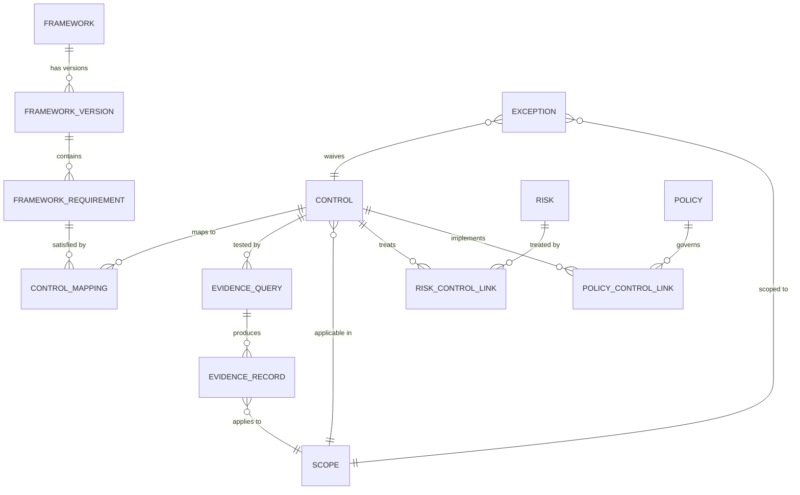

# security-atlas — Architecture Canvas

**Status:** Pre-implementation ideation. No code yet.
**Audience:** Senior GRC engineers, CISOs, security platform architects.
**Date:** 2026-05-10

---

## Executive Summary

`security-atlas` is an open-source, self-hostable, replacement-grade GRC platform that treats a security program as a graph rather than a spreadsheet. The primary v1 user is **the solo security leader at a 50–150-person security-product startup who runs the entire program — risk register, board reporting, SOC 2, vendor reviews, policies, exceptions — alone, and whose customers will diligence the diligence tool itself.** Self-hosting your own GRC platform becomes a trust differentiator; owning the tool eliminates the Year-2 renewal cliff that drives practitioner pain in Vanta/Drata.

The spine is the [Secure Controls Framework](https://securecontrolsframework.com/) — ~1,400 controls already crosswalked to 200+ authority documents using NIST IR 8477 Set Theory Relationship Mapping (STRM) — and the wire format is [NIST OSCAL](https://pages.nist.gov/OSCAL/). Where Vanta and Drata commit you to a vendor-controlled evidence collector, security-atlas commits to a hybrid event-driven + query-driven evidence pipeline that composes existing OSS scanners (Prowler, Steampipe, Cloud Custodian, OPA, Cartography, osquery) rather than rebuilding them. Manual controls and the messy reality of partial coverage and exceptions are first-class. Scope is multidimensional (business unit × environment × geography × cloud × data class), not a single hierarchy. Risk is derived from controls, not joined to them.

Three load-bearing decisions distinguish the design: **(1)** the Unified Control Framework is a directed labeled graph with STRM-typed edges through SCF anchors — not flat per-framework crosswalk tables that decay (worked out in [`UCF_GRAPH_MODEL.md`](./UCF_GRAPH_MODEL.md)); **(2)** evidence ingestion and control evaluation are separated stages with an append-only ledger between them, enabling point-in-time audit replay and audit-period freezing; **(3)** board reporting is a v1 feature, not a v3 nicety, with a templated narrative auto-drafted from real metrics and human-approved before publish. Security questionnaires (CAIQ, SIG, HECVAT, customer bespoke) plug into the same UCF graph — questions are mapped to SCF anchors so one approved answer pre-populates equivalent questions across questionnaires (§4.6).

The v1 success test is binary: does our primary user run their next SOC 2 audit out of security-atlas, generate their next board pack from it, and not reach for Vanta or a Google Sheet to fill a gap? If yes, v1 is done.

---

## 1. Vision and Positioning

### 1.1 Product thesis

> **security-atlas is a control-graph and evidence-pipeline platform that lets you operate one security program against many frameworks, with the same source of truth feeding live posture, audit evidence, and OSCAL exchange — instead of duplicating effort per audit.**

### 1.2 Why not Vanta / Drata / SecureFrame / OpenGRC / eramba

**The commercial incumbents** (Vanta, Drata, SecureFrame, Hyperproof, OneTrust) are vertically-integrated SaaS optimized for "first SOC 2 in 90 days" SMB onboarding. They sell speed-to-attest. Their architectural commitments — proprietary collectors, opaque control libraries, framework-by-framework duplication of evidence — are commercially defensible (lock-in) but engineering-hostile. They model controls as rows in a per-framework grid; security-atlas models them as nodes in a versioned semantic graph. They model evidence as collector output stored in a vendor cloud; security-atlas models it as an append-only stream you own.

The most-cited practitioner pain is the **Year-2 renewal cliff** — quotes on HN and G2 describe invoices jumping 40%+ in renewal, with HIPAA/ISO add-ons disclosed only post-signature ([HN 25808737](https://news.ycombinator.com/item?id=25808737); [SecureLeap 2026](https://www.secureleap.tech/blog/vanta-review-pricing-top-alternatives-for-compliance-automation)). Owning the tool removes that lever entirely.

**The OSS prior art:**
- **eramba** — mature (since 2007), real audit footprint, Community Edition free. Limits: PHP monolith, dated UI, no native cloud-evidence collection. We borrow workflow concepts; we do not build on top.
- **OpenGRC** — useful reference for data-model intuition and framework-seeder packs. **Disqualified as a foundation** for three independent reasons: (1) **CC BY-NC-SA license** — non-commercial share-alike is incompatible with the permissive license we need for an OSS GRC product to be embedded in commercial deployments, (2) **single-tenant Laravel monolith** is the wrong substrate for a control-graph + evidence-pipeline platform, (3) **zero automated connectors** — manual evidence only. We borrow patterns and ship parallel.
- **SimpleRisk** — best-in-class risk register, narrow scope. We support import.
- **CISO Assistant** — rising entrant; cooperate where possible.

We do not pretend OpenGRC or eramba already solve this. They each solve a slice.

### 1.3 Explicit non-goals (v1)

| # | Non-goal | Why |
|---|----------|-----|
| 1 | Enterprise content moat (OneTrust-style 10,000-page regulatory libraries) | Different product; doesn't fit OSS economics |
| 2 | Closed proprietary connectors | Defeats the OSS thesis; locks users in |
| 3 | Replacing SIEM / detection engineering | Detect-as-code is adjacent, not GRC's job |
| 4 | Replacing IAM, MDM, vuln scanners | Compose them; don't rebuild them |
| 5 | "Compliance as a service" managed offering | We ship software; partners run it |

### 1.4 Personas

The primary persona for v1 is anchored on a real user: **the solo security leader at a 70-person security-product startup who runs the entire program — risk register, board reporting, SOC 2, ISO 27001 (prospect-driven), vendor reviews, policies, exceptions — alone.** Every design decision is filtered through "does this help that person?" before "does this scale to a 2,000-person enterprise?"

| Persona | Role | v1 priority | Workflow they care about |
|---------|------|-------------|--------------------------|
| **Solo Security Leader at a 50–150-person security-product startup** (PRIMARY) | Owns: SOC 2 audit, ISO 27001 (when prospects demand it), HIPAA/PCI as customers require, risk register, board reporting, policies, vendor reviews, access reviews, incident response. No GRC team. May add 1–2 GRC-touching members within a year. | v1 lead | "Run the entire program from one tool I own. Generate the board deck on the day of the meeting. Survive the SOC 2 audit without consulting hours. Respond to security questionnaires without rebuilding answers." |
| **GRC Engineer at a 100–2,000-person company** (secondary) | Hybrid security + platform engineer. Owns control-as-code, evidence pipelines, auditor relationships. | v1 supported | "Author a control once, satisfy it across SOC 2 + ISO + HIPAA, watch evidence stream in, see drift instantly." |
| **CISO / Head of Security** (secondary) | Reports posture to board, exec, customers. Buys the tool. | v1 supported | "Program-level posture across BUs/frameworks with board-ready narrative, in one screen." |
| **Internal / External Auditor** | Read-only sampling + walkthrough + SSP review | v1 must-have | "Pull a sample of N items for control X over period Y, with provenance, in OSCAL. Comment on findings in-product, not over email." |
| **Compliance Analyst** | Manual control owner, policy custodian | v2 | "Track policy attestations, vendor reviews, access reviews on a calendar." |

**The solo-operator filter changes specific design points:**
- Setup must be measurable in hours, not weeks — config-as-code seeded from sensible defaults.
- Board reporting is a v1 feature, not a v3 nicety (a CISO at a 70-person co reports to the board quarterly minimum).
- Vendor risk module must work for ~30–80 vendors, not 5,000 — but must include contract dates, DPA status, and review cadence (the spreadsheet escape vector to close).
- Self-host story must work on one mid-size VM. NATS JetStream (single binary), Postgres (single instance), one app server. No required Kafka, no required ClickHouse for v1.
- Manual controls and human attestations are equally first-class as automated — a solo operator cannot author 200 evidence pipelines in a quarter.

**Why this persona over a generic SMB GRC engineer**: a security-product company is the hardest case — your customers will diligence the diligence tool itself. Self-hosting your own GRC platform becomes a trust differentiator ("our compliance evidence does not live in a third party's cloud"). If the design works for that case, it works for less-scrutinized buyers.

### 1.5 "Replacement-grade" — measurable acceptance criteria

A user can credibly drop Vanta/Drata when security-atlas can:

1. Run an end-to-end SOC 2 Type II audit cycle without leaving the tool.
2. Map ≥10 frameworks with shared-control crosswalking such that one piece of evidence satisfies N control instances simultaneously.
3. Provide ≥100 first-party connectors covering AWS, GCP, Azure, GitHub/GitLab, Okta/Azure AD/Google Workspace, Jamf/Intune/Kandji, Jira/Linear, common HRIS, and major SaaS (Slack, 1Password, Datadog, PagerDuty). v1 ships with a focused 12–15-connector subset; full 100+ is a phase-2 milestone.
4. Generate an OSCAL SSP and POA&M that an auditor accepts without manual reformatting.
5. Continuously evaluate ≥80% of *automatable* in-scope controls without human input — and clearly model the remainder as manual.
6. Survive a third-party security review of multi-tenant isolation in self-host deployments.
7. **Be installable, seeded, and producing first evidence within 4 hours by a solo security leader without consulting help.** This is the single most important acceptance criterion — it determines whether the tool is usable by its primary persona.
8. **Generate a board-ready slide pack** (PDF + editable export) covering posture, top risks aging, control coverage trend, open findings, and an auto-drafted narrative — without a separate trip to PowerPoint.

If any of these eight is missing, the tool is not replacement-grade. Pre-v1, we say so.

### 1.6 Anti-patterns we explicitly reject

Practitioner research surfaced the recurring patterns that erode trust in GRC tools. We commit to *not* shipping these:

| Anti-pattern | What it is | Why it kills trust |
|---|---|---|
| **Policy template libraries dressed as a feature** | 50 pre-written policies "ready to ship" | Auditors don't read them; they check `last_revised` and `last_review` dates. The library encourages cargo culting. We ship 5 high-signal templates with explicit ownership, not 50 placeholder docs. |
| **AI-generated policy text and questionnaire answers without human review** | "Auto-draft the policy from your control state" | Hallucinated content makes it into legal-binding artifacts. Auditors privately roll eyes. We support AI assistance for *summarization* and *gap explanation*; we never generate policy text or audit responses unsupervised. |
| **The collector agent on every laptop** | Drata-style endpoint agent for evidence | Customers of security-product companies ask "do you run a vendor's agent?" — the answer matters. We use osquery / Fleet (open) and read-only API integrations. No proprietary agents. |
| **Vanity trust centers** | Public posture page nobody visits before sending the same questionnaire | Skip until v3 unless customers actively demand. |
| **"Continuous monitoring" that runs daily, not continuously** | Marketing language for "we re-poll every 24h" | We commit to event-driven where APIs allow; we name the interval honestly elsewhere. |
| **Per-framework duplicated controls** | A separate `ISO-A.5.15` row from a `SOC2-CC6.1` row even when they're the same control | The whole point of the UCF graph is to refuse this. One control, N framework satisfactions. |
| **Audit-period evidence pollution** | Post-window changes leaking into "as-of" sample populations | We freeze evidence at audit-period boundaries (see §8). |

---

## 2. Domain Primitives

The data model is small on purpose. Six entities carry most of the weight; everything else is a relationship.



### 2.1 Control

| Field | Type | Notes |
|-------|------|-------|
| `id` | string (UUIDv7) | |
| `scf_id` | string | Canonical SCF code (e.g. `IAC-01`). Optional but strongly recommended. |
| `title` | string | |
| `description` | text | |
| `control_family` | enum | SCF taxonomy: AAA, AST, BCD, CFG, CHG, CLD, CPL, CRY, ... |
| `implementation_type` | enum | `automated` \| `semi_automated` \| `manual_attested` \| `manual_periodic` |
| `owner_role` | string | Who owns it (RACI). |
| `lifecycle_state` | enum | `draft` → `proposed` → `active` → `deprecated` → `retired` |
| `applicability_expr` | DSL | A boolean over scope dimensions; see §5. |
| `evidence_query_ids[]` | array | Links to evidence queries. |
| `policy_ids[]` | array | Linked policies. |
| `created_at`, `updated_at`, `version` | meta | Soft-versioned; full history retained. |

Controls are **first-class** whether automated or manual. A `manual_attested` control still has lifecycle, ownership, evidence (uploaded artifact), and freshness — it is not a degraded automated control.

### 2.2 Risk

A risk is a *statement of plausible loss*, not a control failure. Controls *treat* risks; risks are not derived from controls. We support multiple methodologies behind a common surface.

| Field | Type | Notes |
|-------|------|-------|
| `id`, `title`, `description` | | |
| `category` | enum | `confidentiality` \| `integrity` \| `availability` \| `privacy` \| `regulatory` \| `operational` \| `financial` |
| `methodology` | enum | `nist_800_30` \| `fair` \| `cis_ram` \| `iso_27005` \| `qualitative_5x5` |
| `inherent_score` | jsonb | Methodology-specific (FAIR has LEF/LM; NIST has likelihood/impact 1–5). |
| `treatment` | enum | `accept` \| `mitigate` \| `transfer` \| `avoid` |
| `treatment_owner` | string | |
| `linked_control_ids[]` | array | Many-to-many. |
| `residual_score` | jsonb | Computed; see §6. |
| `review_due_at` | timestamp | |

**Default methodology: NIST 800-30 qualitative**, because it is the lowest common denominator most auditors and regulators expect. FAIR is supported for orgs that have invested in it. Methodology is a per-risk field, not global, so they coexist.

### 2.3 Evidence

An evidence record is *a single observation about reality at a point in time*. Provenance is mandatory; no anonymous evidence.

| Field | Type | Notes |
|-------|------|-------|
| `id` | UUIDv7 | Time-ordered. |
| `evidence_query_id` | uuid | What query produced it. |
| `control_id` | uuid | Indexed; many evidence records per control. |
| `scope_id` | uuid | Which scope cell this applies to. |
| `observed_at` | timestamptz | When the underlying system state was observed. |
| `ingested_at` | timestamptz | When we received it. |
| `provenance` | jsonb | Connector ID, source system ID, source record key, query hash, runner ID. |
| `result` | enum | `pass` \| `fail` \| `na` \| `inconclusive` |
| `payload` | jsonb | Raw observation (redacted per policy). |
| `payload_uri` | string | For large artifacts (S3-compatible). |
| `hash` | string | sha256 of payload — used for dedup and tamper detection. |
| `freshness_class` | enum | See below. |
| `valid_until` | timestamptz | When this record is no longer current. |

**Freshness model** — different controls have different acceptable evidence ages. Freshness is a property of the *control*, applied to its evidence:

| Class | Max age | Example controls |
|-------|---------|------------------|
| `realtime` | 24 h | Production firewall config, prod IAM root usage |
| `daily` | 7 d | EDR coverage, MFA enforcement |
| `weekly` | 30 d | Vulnerability scan results |
| `monthly` | 90 d | Access review, vendor security questionnaire |
| `quarterly` | 120 d | DR test, tabletop exercise |
| `annual` | 400 d | Penetration test, policy reaffirmation |

Records past `valid_until` are **stale**, not deleted. Stale evidence drives a `drift` signal; the historical record is preserved for point-in-time audit replay.

### 2.4 Scope (multidimensional)

Scope is **not** a tree. It is a coordinate in an N-dimensional space. The platform ships with a default dimension set; orgs can add dimensions.

| Dimension | Default values |
|-----------|----------------|
| `business_unit` | org-defined |
| `environment` | `prod` \| `staging` \| `dev` \| `sandbox` |
| `geography` | ISO 3166 country codes / regions |
| `cloud_account` | per cloud — AWS account, GCP project, Azure sub, K8s cluster |
| `data_classification` | `restricted` \| `confidential` \| `internal` \| `public` |
| `product_line` | org-defined |

A **scope cell** is a tuple `(bu, env, geo, cloud, dc, product)`. Controls have an `applicability_expr` — a boolean over dimensions. Example: `environment IN ('prod','staging') AND data_classification IN ('restricted','confidential')`.

### 2.5 Framework and FrameworkVersion

These are deliberately separate. `Framework` is `ISO 27001`; `FrameworkVersion` is `ISO 27001:2022` vs `ISO 27001:2013`. Mappings are version-pinned. Upgrading a framework version is an explicit migration, not an in-place mutation.

| Framework field | Notes |
|-----------------|-------|
| `id`, `name`, `slug`, `issuer` | `iso_27001`, ISO/IEC |
| `description` | |
| `latest_version_id` | Pointer to current default. |

| FrameworkVersion field | Notes |
|------------------------|-------|
| `framework_id` | |
| `version` | `2022`, `r5`, `v4`, `2024` |
| `effective_from`, `effective_to` | |
| `status` | `current` \| `legacy` \| `withdrawn` |
| `requirement_count` | denormalized |
| `oscal_catalog_uri` | If we have an OSCAL ingest of it. |

### 2.6 Policy

Policies are governance documents that reference controls (the inverse of "controls implement policies"). A policy without a linked control is a Word doc; a control without a linked policy is engineer cargo culting.

| Field | Notes |
|-------|-------|
| `id`, `title`, `version`, `effective_date` | Policies are heavily versioned. |
| `body_md` | Markdown source; rendered to PDF for attestation. |
| `owner`, `approver` | RACI on the policy itself. |
| `acknowledgment_required_role[]` | Roles whose members must attest annually. |
| `linked_control_ids[]` | What controls it governs. |
| `status` | `draft` \| `under_review` \| `approved` \| `published` \| `superseded` |

---

## 3. The Unified Control Framework

This is the section the existing tools get wrong. It is the heart of the platform.

> **Deep dive:** the graph model is fully worked out — diagrams, traversal queries, versioning, storage decisions, and a concrete "one MFA evidence record satisfies six frameworks" walkthrough — in the companion document [`UCF_GRAPH_MODEL.md`](./UCF_GRAPH_MODEL.md).

### 3.1 The graph, not the spreadsheet

Vanta-shaped tools maintain framework crosswalks as flat tables: `(control_in_framework_A, control_in_framework_B)`. This decays with every framework revision and silently rounds N:M relationships to 1:1.

security-atlas models the UCF as a **directed labeled graph**:

- **Nodes:** every requirement in every FrameworkVersion (e.g., `SOC2:2017:CC6.1`, `ISO27001:2022:A.5.15`, `NIST_CSF:2.0:PR.AA-01`, `PCI:4.0:7.2.1`).
- **Spine nodes:** SCF controls (`SCF:IAC-01`) acting as semantic-equivalence-class anchors.
- **Edges:** STRM-typed mappings (per [NIST IR 8477](https://csrc.nist.gov/pubs/ir/8477/final)) between requirements and SCF anchors, never directly between framework requirements.

Because all framework-to-framework relationships are derived through SCF anchors, mappings stay coherent under versioning: an ISO 27001:2013 → ISO 27001:2022 update changes only the edges from ISO requirements to SCF, not the SCF graph itself.

### 3.2 STRM mapping cardinality

NIST IR 8477 defines five relationship types, each with a strength score 0.0–1.0:

| Relationship | Meaning | Example |
|--------------|---------|---------|
| `subset_of` | Source is fully covered by target. | `ISO27001:A.9.4.2 subset_of SCF:IAC-22` |
| `superset_of` | Source covers more than target. | `SCF:IAC-01 superset_of SOC2:CC6.1` (SCF is broader) |
| `intersects_with` | Partial overlap. | `PCI:8.3 intersects_with HIPAA:164.312(d)` |
| `equal` | Logically equivalent. | `NIST_800_53:AC-2 equal SCF:IAC-15` |
| `no_relationship` | Confirmed *no* overlap. (Yes, this is data — it suppresses false suggestions.) | |

A **strength** field captures auditor judgment: `(equal, 1.0)` is full confidence; `(intersects_with, 0.4)` flags partial coverage that needs supplemental evidence.

This means **one piece of evidence can satisfy N controls automatically** when their SCF anchors are connected, and the platform can compute *coverage strength* per requirement: if your evidence covers SCF:IAC-22 with strength 1.0, and ISO27001:A.9.4.2 → SCF:IAC-22 with strength 0.8, the ISO requirement is covered at 0.8 — and the UI surfaces the gap.

### 3.3 Versioning strategy

- `FrameworkVersion` is immutable once `status='current'`. Changes ship as new versions.
- Mappings (`requirement → SCF`) are pinned to a `FrameworkVersion` AND a `SCF release`. The mapping table has its own version lineage.
- A `framework_version_migration` job suggests likely 1:1 mappings between adjacent versions, flagging the rest for human review. Rotting is bounded by SCF release cadence (quarterly), not the user's audit calendar.

### 3.4 OSCAL ingest and export

| Direction | OSCAL model | Use |
|-----------|-------------|-----|
| Ingest | `catalog` | Import a framework version (NIST 800-53r5 catalog ships from NIST as OSCAL JSON). |
| Ingest | `profile` | Import a tailored baseline (FedRAMP Moderate). |
| Ingest | `component-definition` | Import "this AWS service satisfies these controls" definitions. |
| Export | `system-security-plan` (SSP) | Generate the SSP for an auditor. |
| Export | `assessment-plan` / `assessment-results` | Generate the audit plan and what we found. |
| Export | `plan-of-action-and-milestones` (POA&M) | Track open findings to remediation. |

We use [IBM compliance-trestle](https://github.com/oscal-compass/compliance-trestle) under the hood for OSCAL serialization; it is the most mature OSCAL SDK and CNCF/Linux Foundation–affiliated.

### 3.5 SCF as the canonical catalog

We ship SCF (latest release) as the default control catalog. Users can:
- Use SCF directly as their internal control library.
- Override with a custom catalog while keeping SCF as the mapping spine.
- Import additional catalogs (NIST 800-53, CSA CCM if licensed) as alternative anchor sets.

We treat **CSA CCM** as opt-in import for cloud-native overlays, because its commercial-product embed terms are murky for a distributed OSS product. We treat **UCF Common Controls Hub** as off-limits — proprietary IP.

---

## 4. Evidence Engine

### 4.1 Evidence SDK (defined first, before any connector)

The SDK contract is the architectural commitment. The ledger has exactly one canonical inbound API: `IngestEvidence(record) → EvidenceReceipt`. The SDK exposes that API through **two complementary profiles**, not a primary and a fallback:

| Profile | Direction | Who initiates | Use when |
|---|---|---|---|
| **Connector** (pull / subscribe) | Platform → Source | security-atlas reaches out and queries / subscribes | Source has a stable API and we have credentials to reach it |
| **Pusher** (push) | Source → Platform | Source initiates and pushes to security-atlas | Source is behind a firewall, ephemeral (CI), event-emitting (webhook), or owns its scheduling |

Many real connectors implement both. The GitHub connector pulls org/repo state on a schedule *and* receives push events from GitHub's webhook subscription — both flow into the same ledger via the same `IngestEvidence` call. CI/CD evidence (SAST, SCA, container scans, deploy events) is push-only by nature. Custom internal tools, aggregating middleware, telemetry-tap configurations (Vector / OTEL collectors), and air-gapped data diodes all become first-class evidence sources via push.

Connector profile methods (gRPC, language-agnostic, runs as a separate process):

| Method | Returns | Notes |
|--------|---------|-------|
| `Describe()` | `ConnectorManifest` | name, version, supported source types, required scopes, rate-limit hints, **profiles_supported** |
| `AuthMethods()` | `[AuthMethod]` | OIDC, API key, IAM role, OAuth flow, SCIM token |
| `HealthCheck(creds)` | `HealthResult` | Can we reach the source? |
| `ListEvidenceKinds()` | `[EvidenceKind]` | Each kind has a registered schema URI. |
| `Pull(kind, since, scope_filter)` | `Stream<EvidenceRecord>` | Snapshot/query mode. |
| `Subscribe(kind, scope_filter)` | `Stream<EvidenceRecord>` | Event-driven streams (when source supports). |
| `VerifyProvenance(record)` | `bool` | Cryptographic re-verification when applicable. |

Pusher profile surface (REST + gRPC + CLI + per-language SDKs):

| Endpoint / surface | Purpose |
|---|---|
| `POST /v1/evidence:push` | Single record or batch (≤100). Idempotency-key required. Schema-validated. |
| `Push(stream<EvidenceRecord>)` (gRPC) | High-throughput streaming push. |
| `security-atlas evidence push` CLI | Universal escape hatch — works from any shell, CI, cron. |
| Go / Python / TypeScript / Java SDKs | Embed in customer code. |

Push auth: short-lived OIDC tokens from CI IdPs (GitHub Actions, GitLab CI, AWS IRSA), platform-issued API keys, or mTLS — each scoped at issue time to (tenant × evidence_kind set × scope predicate × TTL). Idempotency keys, rate limits, schema-registry validation, and provenance metadata are all mandatory. Anonymous push, schemaless push, and scope-less push are explicitly rejected.

**The schema registry** is the contract enforcement point. Every `evidence_kind` has a stable identifier, a JSON Schema, an owner, default SCF anchor mappings, and semver. Tenants can register private kinds for custom internal tools without touching the global namespace — the OpenTelemetry-semantic-conventions analog.

> **Deep dive:** the full SDK contract — both profiles, push security threat model, middleware patterns (aggregating, telemetry-tap, air-gapped one-way bridge, cross-cluster federation), CLI and SDK details, and roadmap — is in [`EVIDENCE_SDK.md`](./EVIDENCE_SDK.md).

This contract was written before listing any connector deliberately, so AWS-shaped assumptions don't leak. The push profile was added because pull-only architectures structurally cannot ingest CI/CD evidence, behind-firewall sources, telemetry-tap deployments, or air-gapped systems — all of which a security-product startup encounters in the first year.

### 4.2 v1 connector roster

| Connector | Why v1 | Source pattern |
|-----------|--------|----------------|
| AWS | Universal cloud baseline | Event (CloudTrail → EventBridge) + Query (Steampipe-style) |
| GCP | Second cloud baseline | Event (Audit Logs → Pub/Sub) + Query |
| Azure | Third cloud baseline | Event (Activity Log → Event Hub) + Query |
| Kubernetes | Container reality | Event (audit log) + Query (kube-bench) |
| GitHub | Code provenance + access | Event (audit log API) + Query |
| GitLab | Same | Same |
| Okta | IdP | Event (System Log) + Query (SCIM) |
| Azure AD / Entra | IdP | Event + Query |
| Google Workspace | IdP + endpoint | Event (Reports API) + Query |
| Jamf / Intune | MDM | Query (mostly) |
| osquery / Fleet | Endpoint posture | Query (host-driven) |
| Jira / Linear | Ticket evidence | Query + webhook |
| Slack | Comms-record evidence | Event (audit log) for enterprise |
| 1Password / Bitwarden | Secrets posture | Query |
| Datadog / Grafana / PagerDuty | Ops/IR evidence | Query |
| HRIS (Rippling, BambooHR, Workday) | Personnel lifecycle | Query (SCIM where available) |
| CSV / S3 / SFTP / Manual upload | Universal escape hatch | Query (cron + file watcher) |

Roughly 17 connectors covers ~80% of mid-market evidence demand. Community can extend to Vanta's 300+ over time.

### 4.3 Evidence ingestion vs control evaluation (separated stages)

```
[ Source system ]
       │
       ▼   (event or pull)
[ Connector ]
       │ raw record
       ▼
[ Ingestion stage ]  --- canonicalize, redact, hash, scope-tag, store in ledger
       │
       ▼   (immutable evidence ledger, append-only)
[ Evaluation stage ]  --- read-only consumer; runs queries/policies against records
       │
       ▼
[ Control state ]  --- pass/fail/inconclusive per (control × scope × time)
```

This separation means:
- Evaluation logic can be replayed against historical evidence at will (point-in-time audit replay).
- Bugs in evaluation never corrupt source-of-truth evidence.
- New controls can be evaluated retroactively against existing evidence.

### 4.4 Control-as-code (distinct from policy-as-code and detect-as-code)

A **control** is authored as a small bundle:

- A YAML/JSON manifest declaring metadata (id, framework mappings via SCF, applicability_expr, freshness class, owner).
- One or more **evidence queries** — Rego/SQL/JSON-path/Sigma over the evidence ledger.
- One or more **enforcement hooks** (optional) — OPA/Custodian/Kyverno policies that prevent drift in the source system.
- A **manual-evidence schema** (optional) — when the control requires human attestation, the form schema for that.
- Tests — fixture evidence + expected pass/fail.

| Concept | Substrate | Runtime | Output |
|---------|-----------|---------|--------|
| Control-as-code | OSCAL component-definition + bundle | Evaluation stage | Control state |
| Policy-as-code | OPA Rego, Cloud Custodian, Kyverno | Source-system runtime | Drift prevented |
| Detect-as-code | Sigma, Panther, Snowflake SQL | SIEM / detection runtime | Alerts (out of scope) |

Conflation of these is the most common error in the GRC engineering discourse. We pick clear boundaries and stick to them. See [grc.engineering](https://grc.engineering/) for the broader manifesto context.

### 4.5 Manual evidence as first-class

Manual controls render the same UI surface as automated ones: a control card with its mappings, freshness clock, current state. The difference is the evaluation source — for `manual_periodic`, an authorized owner uploads evidence (a screenshot, a signed PDF, a meeting log) on the schedule; for `manual_attested`, a roleholder asserts the state with a digital acknowledgment that becomes an evidence record. Both feed the same evidence ledger.

If the org has 30% manual controls, that 30% looks no less rigorous in the dashboard than the automated 70%. This is intentional — pretending manual controls don't exist is the most common path to "the tool says we're green but we're not."

### 4.6 Security questionnaires (CAIQ, SIG, HECVAT, customer)

Security questionnaires are the dominant inbound demand on a security-product startup's GRC program — every prospect of meaningful size sends a CAIQ, a SIG Lite, or a bespoke Word doc before contract. Practitioner research consistently shows: **the same answers get rewritten for every customer, in spreadsheets, by hand**, even when the org owns Vanta or Drata. This is the highest-ROI workflow we ship.

#### 4.6.1 The questionnaire is a graph node

Every question is a first-class node in the same UCF graph that holds framework requirements (see [`UCF_GRAPH_MODEL.md`](./UCF_GRAPH_MODEL.md)). Questions are mapped to **SCF anchors** with STRM-typed edges, exactly like framework requirements:

```
QuestionnaireQuestion[CAIQ-IAM-02] --equal/1.0--> SCF:IAC-06 (MFA)
QuestionnaireQuestion[SIG-G.1.1]   --equal/0.9--> SCF:IAC-06
QuestionnaireQuestion[HECVAT-AAAI-04] --subset_of/1.0--> SCF:IAC-06
```

Once mapped, **answering one question generates a candidate answer for every equivalent question across questionnaires**. A CAIQ answer about MFA pre-fills the SIG question and the HECVAT question. The UCF graph's payoff extends from "one control satisfies six frameworks" to "one answer pre-populates six questionnaires."

#### 4.6.2 Entities

| Entity | Purpose | Key fields |
|---|---|---|
| `Questionnaire` | A template (CAIQ v4.1, SIG Lite 2026, custom-customer-X) | `id`, `name`, `version`, `source` (csa/shared_assessments/educause/custom), `domain_taxonomy[]`, `license_class` (free/restricted/proprietary), `import_policy` |
| `QuestionnaireQuestion` | One question in a template | `id`, `questionnaire_id`, `code` (e.g., `IAM-02`), `domain`, `text`, `answer_type` (yes_no_na / scaled / freeform), `linked_scf_anchors[]` (with strength) |
| `QuestionnaireResponse` | An instance — "our answers to CAIQ for customer X, on date Y" | `id`, `questionnaire_id`, `for_customer` (or `for_org` for self-published), `period_id` (frozen evidence window), `status` (draft / under_review / approved / sent), `pdf_export_uri` |
| `QuestionnaireAnswer` | One answer within a response | `id`, `response_id`, `question_id`, `answer_value`, `narrative`, `cited_evidence_ids[]`, `cited_policy_ids[]`, `cited_control_ids[]`, `authored_by`, `ai_assisted` (bool), `ai_model` (if assisted), `human_approved` (bool), `human_approver` (if approved) |
| `AnswerLibrary` | Reusable canonical answers — the "we always say this for MFA" pattern | `id`, `scf_anchor_id`, `canonical_text`, `last_reviewed_at`, `review_owner` |

#### 4.6.3 License posture (the part that matters)

[Research, May 2026.](#sources)

| Questionnaire | Current version | Ships in security-atlas? | Mechanism |
|---|---|---|---|
| **CAIQ v4.1** (CSA) | 283 questions, 17 domains, Dec 2025 | **No (template not bundled)** — but ingest + answer flow ships v1 | User downloads from CSA, imports the file. Avoids CSA commercial-embed license. |
| **CAIQ-Lite v4.1** (CSA) | 138 questions | Same as above | Same. |
| **SIG 2026 Lite** (Shared Assessments) | ~128 questions | **No** — Shared Assessments membership is members-only (~$7,200/yr). Ingest customer-supplied responses only. | Import from customer-provided file. |
| **SIG 2026 Core** (Shared Assessments) | ~855 questions | Same. | Same. |
| **HECVAT 4.1.5** (EDUCAUSE/REN-ISAC) | 321 questions, free | **Yes — bundled** | Ships in `questionnaire_templates/` with default SCF mappings. |
| **VSAQ** (Google, Apache-2.0, unmaintained) | n/a | Yes — reference schema only | Bundled as a schema example, not a live questionnaire. |
| **Custom customer questionnaires** | Word/Excel/PDF | Yes — universal import | Parser extracts questions; user maps each to SCF (AI-suggested) once; future receipts auto-map. |
| **NIST CSF / CIS CSAT self-assessments** | Free | v2 | Bundled as orthogonal "internal assessment" templates. |

**Concrete OSS stance:** ship the SCF crosswalk and HECVAT bundled (both permissive). For CAIQ and SIG, we ship the *machinery* (ingest, mapping, AI-assist, export), not the *content*. The user provides the file; we provide the workflow.

#### 4.6.4 Workflows

**Inbound (customer sent us a questionnaire):**

```
Customer sends CAIQ.xlsx
    │
    ▼
Import — parse to QuestionnaireQuestion rows
    │
    ▼
SCF mapping — match each question to SCF anchors
  - Cached for canonical questionnaires (CAIQ, SIG, HECVAT)
  - AI-suggested for bespoke; human approves the mapping once,
    then it's permanent for that template
    │
    ▼
Answer drafting per question:
  1. Check AnswerLibrary for SCF anchor → use canonical answer if present
  2. Else: RAG over evidence ledger + policies, scoped to mapped SCF anchor
  3. Generate candidate answer with required citations to evidence_id / policy_id
  4. Show DRAFT to human reviewer with "approve / edit / reject"
    │
    ▼
Reviewer approves answer-by-answer (no bulk-approve all)
    │
    ▼
Export — PDF + Excel (CAIQ format) / + customer's original format
    │
    ▼
QuestionnaireResponse pinned to evidence period (audit-period freezing)
```

**Outbound (publish our own CAIQ/HECVAT):**

The org maintains its own CAIQ-formatted self-attestation as a *living artifact* derived from current evidence. Whenever evidence drifts past freshness or a control fails, the published CAIQ flags out-of-date answers. A staleness banner gates re-publish.

#### 4.6.5 AI-assist boundary (explicit)

This is the highest-risk feature in the entire platform. Practitioner research is unambiguous: **auditors and prospects roll eyes at AI-generated security questionnaire responses** that hallucinate control claims. Our boundary is hard:

| Allowed | Not allowed |
|---|---|
| AI suggests a draft answer with **mandatory citations** to specific evidence IDs and/or policy IDs. | AI publishes any answer without one-click human approval. |
| AI explains gaps ("evidence covers SCF:IAC-06 but freshness is 95 days, consider re-running before answering"). | AI fabricates control coverage that has no evidence backing. |
| AI suggests SCF mapping for an unmapped question; human approves once, mapping is canonical thereafter. | AI auto-approves its own mappings. |
| AI summarizes prior responses for similarity matching. | AI uses Tenant A's confidential prior answer to seed Tenant B's draft. |

Provenance is enforced at the schema level: `QuestionnaireAnswer.ai_assisted=true` answers cannot have `human_approved=true` without `human_approver` set, and the audit log shows model name + version + timestamp + diff between AI draft and final.

**Inference backend is pluggable:**

- **Default: local Ollama** with a small instruction-tuned model (`llama3.1:8b`, `qwen2.5:14b`, or similar). Ships in the docker-compose. No data leaves the deployment.
- **Optional: cloud** — Anthropic, OpenAI, or Bedrock via API key. Off by default. When enabled, the deployment owner explicitly opts in per-tenant; a banner indicates "AI assist routes to {provider}" wherever drafts appear.
- **The grounding stack is the same** for either backend: pgvector or Qdrant for embeddings of (a) prior approved answers, (b) policy chunks, (c) recent evidence summaries. Citations are required at retrieval, not generation — the model can only cite documents that the retriever returned.

#### 4.6.6 Roadmap placement

| Phase | What we ship |
|---|---|
| **v1** | Universal questionnaire import (Excel/CSV/JSON/Word). HECVAT bundled. CAIQ/SIG ingest of customer-provided files. Manual answer authoring with cited evidence. AnswerLibrary for canonical SCF-anchored answers. PDF export. **No AI-assist yet.** |
| **v2** | Local-Ollama AI-assisted drafting with mandatory citations. Cloud-LLM optional. Inbound questionnaire batch processing. Per-customer answer libraries with diff/review. |
| **v3** | Native CAIQ + HECVAT publish to STAR Registry / trust center. Outbound self-published questionnaires that auto-stale on evidence drift. Optional CSA membership integration to bundle CAIQ template. Vendor-questionnaire portability across portfolio orgs. |

---

## 5. Scopes and Multitenancy

### 5.1 Scope dimensions

(Repeated from §2.4 with the runtime semantics.) Each control's `applicability_expr` is a boolean expression over scope dimensions. Example:

```
environment IN ('prod', 'staging')
AND data_classification IN ('restricted', 'confidential')
AND geography IN ('US', 'EU')
AND cloud_account.provider = 'aws'
```

The evaluation engine, given a control and the org's universe of scope cells, computes the **applicability set** — the cells where this control must be evaluated. A control's overall pass requires pass in every applicable cell.

### 5.2 Per-cell evaluation

Each `(control × scope_cell × time)` triplet has its own state. The dashboard rolls up:
- by control across cells (where is it failing?)
- by cell across controls (what's broken in `prod` × `restricted` × `EU`?)
- by framework requirement across the SCF graph (what does my SOC 2 look like?)

### 5.3 Scope inheritance and override

Some scope dimensions are hierarchical (BU, geography). Controls can be declared at a parent level and inherit; child cells can override applicability or evidence requirements. Overrides are tracked as first-class artifacts (auditors care who changed scope).

### 5.4 Tenant isolation (Postgres RLS, named explicitly)

Multi-tenancy is enforced at the database layer using **PostgreSQL Row-Level Security**. Every tenant-scoped table has a `tenant_id` column and an RLS policy that restricts access based on the connection's `app.current_tenant` setting. Application code that forgets a `WHERE tenant_id = ...` cannot leak — RLS denies.

This is the only multi-tenancy strategy that does not depend on application-code correctness. For self-host deployments, this means a single Postgres instance can safely serve multiple tenants. For SaaS deployments, each tenant gets its own RLS context.

Storage tier (object store for large artifacts) uses per-tenant prefixes with tenant-scoped credentials — separate enforcement at separate layers.

### 5.5 Framework scope — the per-framework subset of cells and controls

The single most-misunderstood real-world fact about multi-framework programs is that **scope is per-framework, not global**. PCI's "cardholder data environment" (CDE) is not the same as HIPAA's "covered systems" is not the same as SOC 2's auditor-attested system is not the same as ISO 27001's ISMS scope. A control may be operationally applied across all 50 of an org's scope cells, but its evidence only *counts* for PCI in the 5 cells inside the CDE.

This intersection — between a control's operational applicability and a framework's audit scope — is how a unified control library produces a *subset* of relevant controls per framework, automatically.

**The model adds one entity:**

```
FrameworkScope {
  id
  framework_version_id            -- which framework version this scope belongs to
  name                            -- "PCI 4.0 CDE", "HIPAA Covered Systems Q3 2026"
  predicate                       -- a boolean over scope dimensions, same DSL as Control.applicability_expr
  effective_from, effective_to    -- scope can change over time (e.g., post-segmentation)
  status                          -- draft | approved | active | retired
  approved_by, approval_evidence  -- who locked this scope, and the artifact (architecture diagram, SOW)
}
```

**Two layers of applicability, intersected:**

```
Control.applicability_expr      // where the control IS applied (engineering reality)
        ∩
FrameworkScope.predicate         // what's in-scope for THIS framework (audit reality)
        =
effective_scope(control, framework)   // cells where the control's evidence COUNTS for this framework
```

**The canonical examples:**

| Framework | Typical FrameworkScope predicate | Lever for scope reduction |
|---|---|---|
| **PCI DSS 4.0** (CDE) | `data_classification IN ('cardholder_data') OR connected_to_chd = true OR security_impacting_chd = true` | Network segmentation, tokenization, P2PE — each removes cells from the CDE |
| **HIPAA Security Rule** (Covered) | `phi_handling = true OR product_line IN ('clinical', 'patient_portal')` | De-identification, BAA-bounded systems boundary |
| **SOC 2** (System) | Auditor-defined; can be any predicate. Often `product_line = 'core_saas'` excluding `internal_tools` | Carving the system definition tightly with the auditor up front |
| **ISO 27001** (ISMS) | Org-defined ISMS scope statement, codified as a predicate | The Statement of Applicability is the formal artifact |
| **NIST CSF / 800-53** (System) | Per-system; for FedRAMP this is the authorization boundary | Boundary scoping is a heavy artifact, often diagrammed |
| **GDPR** | Different shape — predicate over data records, not infrastructure cells. Special-cased. | Data minimization, anonymization |

**How the graph traversal accounts for it:**

When computing coverage for `framework_requirement R`:

1. Walk `R → SCF anchors → controls` (the existing graph traversal).
2. For each candidate control `C`, compute `effective_scope(C, R.framework) = C.applicability_expr ∩ R.framework.scope.predicate`.
3. Coverage is the weighted strength × effectiveness aggregated **only over cells in `effective_scope`**, not over all cells where `C` is applied.

The practical consequences the user actually feels:

- **The PCI dashboard naturally filters down** from the org's full ~200 controls to the ~80 that map (via SCF) to in-scope PCI requirements, evaluated only over CDE cells.
- **Scope-reduction work is a first-class operation.** Removing a system from the CDE is shrinking `FrameworkScope.predicate` — coverage math updates immediately, and the auditor sees a precise before/after.
- **A single control can have different coverage scores for different frameworks at the same time.** Okta MFA might be 1.0 covered for SOC 2 (applied across the whole system) but 0.6 covered for PCI (one of the 5 CDE cells didn't have MFA enforced last week). Each number is honest in its own context.
- **Framework scopes are versioned and audit-evidenced** in their own right — when did the CDE change, why, who approved, against what diagram. This is itself audit evidence.

**Why this is hard for flat-table tools:** they can't intersect "control applicability" with "framework scope" because they don't model framework scope at all — they assume one global scope. Real programs have to maintain the intersection in spreadsheets. The graph model + `FrameworkScope` makes this a query, not a copy-paste exercise.

**FrameworkScope vs. SCF anchor scope mappings:** these are different things. SCF anchors are framework-agnostic concepts. The mapping `FrameworkRequirement → SCF anchor` says "this concept is what the requirement is about." `FrameworkScope` separately says "even though the concept applies broadly, this framework's audit only cares about it in *these* cells." The two intersect at evaluation time.

---

## 6. Risk Register Linkage

### 6.1 Treatment statuses

| Treatment | Meaning | Rules |
|-----------|---------|-------|
| `accept` | Risk acknowledged, no action. | Requires named accepter, accepted_until date, exec sign-off if above tolerance. |
| `mitigate` | Treated by linked controls. | Must have ≥1 linked control. |
| `transfer` | Insurance, contract, third party. | Must reference instrument (policy #, SOW). |
| `avoid` | Activity stopped / not entered. | Status-only, no controls expected. |

### 6.2 Residual risk derivation

Residual = inherent × (1 − control_effectiveness). `control_effectiveness` is a derived score per linked control:

```
control_effectiveness = (
    weight_design       * design_score        // human-set, 0..1
  + weight_operation    * operational_score   // derived from evidence pass rate over rolling window
  + weight_coverage     * coverage_score      // applicability set ∩ scope where control passed
)
```

This makes residual risk *honest*: a control with great design and 40% evidence pass rate over the last 30 days drops effectiveness, raising residual. Risk dashboards trend with reality, not paper.

### 6.3 Exception / waiver workflow

Exceptions are **always scoped and time-bounded**:

| Field | Notes |
|-------|-------|
| `control_id` | Required. |
| `scope_cell_predicate` | What scope cells the exception applies to. |
| `justification` | Required, freeform. |
| `compensating_controls[]` | What we're doing instead. |
| `requested_by`, `approved_by` | Roles enforced. |
| `expires_at` | Required, max 365 days. Auto-renewal forbidden. |
| `status` | `requested` \| `approved` \| `denied` \| `active` \| `expired` |

Expired exceptions revert the control to evaluating normally. The expiration calendar is a first-class dashboard.

---

## 7. Metrics and Posture

### 7.1 KPIs

| KPI | Type | Definition |
|-----|------|------------|
| Control coverage | Lagging | `(active_controls_with_at_least_one_passing_evidence_record_in_freshness_window) / (active_controls_with_applicability)` |
| Evidence freshness | Leading | `% of (control, scope_cell) tuples with evidence inside freshness window` |
| MTTR-control | Lagging | Median time from `control_state=fail` to `control_state=pass` |
| Drift count | Leading | `(controls passing yesterday) − (controls passing today)`, signed |
| Exception inventory | Leading | Open exceptions by aging bucket; expiring-in-30-days highlighted |
| Audit readiness index | Composite | Weighted blend per framework — coverage × freshness × open-finding-burndown |
| Policy attestation rate | Lagging | % required acknowledgments completed in window |
| Vendor risk burndown | Lagging | High-criticality vendor reviews on time |

### 7.2 Leading vs lagging

Leading: drift count, evidence freshness, expiring exceptions, expiring policy acknowledgments. They predict the next audit.

Lagging: coverage, MTTR-control, audit findings closed, attestation rate. They report what already happened.

We display them on separate dashboards — mixing them lets execs misread the program.

### 7.3 Aggregation across scopes

KPIs are computed per scope cell, then aggregated up scope dimensions. The same KPI can be sliced by BU, environment, geography, or cloud account. The aggregation operator is explicit per KPI (sum vs weighted average vs worst-cell).

### 7.4 Benchmarks / peer comparison

In OSS, we don't have proprietary peer data. We support **opt-in anonymized telemetry** (off by default) that contributes to community benchmarks — control coverage distribution by framework, MTTR-control distribution, evidence freshness percentiles. This is not Vanta's "you're in the 78th percentile" feature, but a credible OSS approximation.

### 7.5 Board reporting (first-class)

Practitioner research surfaced this as an underserved JTBD: **no GRC tool produces a board-ready narrative** — every CISO rebuilds the deck quarterly in Google Slides. IANS Research (March 2026) reports 34% of CISOs say boards dismiss security warnings out of hand and only 29% of board directors describe cybersecurity updates as very effective ([IANS](https://www.iansresearch.com/resources/all-blogs/post/security-blog/2026/03/24/boards-give-ciso-cybersecurity-reporting-a-mixed-grade)). This is a v1 feature, not a v3 one.

**The board pack** is generated as PDF + editable Markdown/HTML for paste into the deck of choice. It is *not* a slide-rendering engine — that's overreach. It produces:

| Section | Source | Auto-drafted narrative |
|---|---|---|
| Posture summary | Coverage + freshness composite per framework | "We are in audit-ready state for SOC 2; ISO 27001 readiness at 78%, gap concentrated in A.8 asset management." |
| Top risks aging | Risk register, sorted by residual × age-since-treatment | "Three high-residual risks are open >90 days: ..." |
| Control coverage trend | Last 90 / 180 / 365 days, per framework | "Control coverage rose from 71% to 84% in the quarter; one regression in CC8.1 driven by ..." |
| Open findings burndown | Audit findings + POA&M | Trend chart + median-time-to-close. |
| Phishing / training | Training connector (v2; manual upload v1) | "97% phishing pass rate, target ≥95%." |
| Patching cadence | Vuln-scanner integration | "Median P1 patch time 4 days, target ≤7." |
| Incident response | IR ticketing integration | "Two incidents in the period; both contained <SLA." |
| Vendor risk burndown | Vendor module | "12 of 14 high-criticality vendor reviews on time." |
| Investment vs. coverage | Manually entered tool/headcount cost vs. control coverage delta | "Q investment: $X; coverage delta: +Y points." Critical for board narrative; no GRC tool does this today. |
| Asks of the board | Editable freeform | Solo operator drafts; tool does not write asks. |

**Auto-drafted narrative** uses templated language (Jinja-style) over the metrics, with optional LLM polish on a per-section, human-in-the-loop basis. We never publish auto-narrative without one-click human approval. This is the explicit boundary against the "AI-generated audit response" anti-pattern.

**Business-impact-in-dollars** (ALE — Annualized Loss Expectancy) is supported for the top N risks that use the FAIR methodology. Below the top N, we present qualitative bands. Practitioners report this is the actual board-trusted format.

**Deck cadence:** monthly briefs (single page, posture + drift + top-3 risks) and quarterly full pack. Both are pinned snapshots — the board is reading what posture *was* at the report date, even if the live state has changed.

---

## 8. Audit Workflow

### 8.1 Auditor role

A dedicated `auditor` role with:
- Read-only access to evidence, controls, scopes, exceptions, policies.
- Sample-pull tools (random N from population, deterministic seed for reproducibility).
- Walkthrough recording (annotated screen captures + transcript stored alongside evidence).
- Their own workspace for organizing testing notes — not visible to the auditee.
- A time-window scope (auditor sees state as of `audit_period_end`, not live).

This role is **first-class**, not an afterthought. Auditors who can do their work in our tool become advocates; auditors who can't insist on Vanta or spreadsheets.

### 8.2 OSCAL SSP / POA&M export

| Artifact | Generated from |
|----------|----------------|
| SSP (`system-security-plan`) | Org profile + scope cells + applicable controls + control implementation narratives + linked policies |
| Assessment Plan | Auditor's selected sample population + planned procedures |
| Assessment Results | Sampled evidence records + auditor pass/fail/finding annotations |
| POA&M | Open findings with milestones, owners, due dates |

We commit to OSCAL JSON v1.1.x compatibility and ship an `oscal-export` CLI alongside the UI export.

### 8.3 Walkthrough and sample-pull primitives

- `Population(control, scope_predicate, time_window)` — defines what a sample is drawn from.
- `Sample(population, n, seed)` — deterministic, reproducible.
- `Walkthrough(control, narrative, attachments[])` — auditor or owner recorded explanation, hashed and signed.
- `Finding(control, severity, description, linked_evidence[])` — drives POA&M.
- `AuditPeriod(audit_id, period_start, period_end, frozen_at)` — see §8.4.
- `AuditNote(scope: control | finding | sample, author, body, visibility)` — auditor↔auditee threaded comments inside the tool.

These primitives compose. An audit cycle is a graph of populations, samples, walkthroughs, findings, frozen periods, and notes against the control set.

### 8.4 Audit-period freezing (the snapshot primitive)

A recurring practitioner complaint about Vanta/Drata is **post-window evidence pollution** — a control is failing on the day of the auditor walkthrough but passes the next morning, and the sample population shifts under the auditor's feet. We solve this with explicit freezing.

When an `AuditPeriod` is created, the user (or auditor) calls `freeze(period_id, frozen_at)`. From that moment:
- Sample populations for that period draw only from evidence with `observed_at ≤ frozen_at`.
- Control state for the period is computed against frozen evidence; live state continues independently.
- New evidence after `frozen_at` does not retroactively change the auditor's view.
- Frozen state is hashed and signed; tampering is detectable.

The append-only evidence ledger makes this cheap — we don't need separate snapshots, we just shift the read horizon. This is one of the practical wins of the event-driven evidence architecture (§4).

### 8.5 Auditor collaboration (the "Audit Hub" pattern)

Practitioners cite Drata's in-product auditor↔auditee comment thread as the single most valuable feature when migrating between tools. We replicate it as a first-class workflow:

- Auditor leaves a comment on a control / sample / finding.
- Auditee receives a notification, replies in-product, attaches additional evidence.
- Comment thread is retained as an audit artifact, exported to OSCAL `assessment-results` `observation` annotations.
- No email back-and-forth. No "I'll send you the screenshot in Drive" loop.

This is not a separate "messaging" feature — it's threaded annotations on first-class objects.

---

## 9. Architecture and Tech Stack

Opinionated. One choice per slot, defended in one paragraph.

### 9.1 Backing data store

**PostgreSQL 16+ (primary) + S3-compatible object store (artifacts) + ClickHouse (evidence ledger analytics, optional v2).**

Postgres because: row-level security, JSONB flexibility for evolving evidence payloads, mature operational tooling, and you can run it anywhere from a Pi to RDS. Object store for evidence artifacts that exceed 1 MB. ClickHouse only when evidence-record volume crosses ~10⁹ — added behind a read-model interface so v1 doesn't depend on it.

Reject: Neo4j as primary (the graph is not big enough to need it; we use Postgres with `ltree` and recursive CTEs, or `pg_graph` extensions, for graph traversals). Reject: Mongo (schemaless evidence is a bug, not a feature; provenance demands schema).

### 9.2 Backend language/runtime

**Go for the platform core; Python for the connector SDK reference implementation; community connectors in any language over the gRPC contract.**

Go because: static binary deploy, low operational overhead for self-host, strong concurrency for evidence-stream consumers, mature OSCAL bindings via compliance-trestle interop (which is Python — so we ship a stable gRPC bridge for it). Python for connectors because the data-engineering ergonomics dominate.

### 9.3 Event/queue layer

**NATS JetStream for v1.**

JetStream gives us durable streams, key-value, and object store in one binary, with at-least-once delivery and stream replay (critical for evidence reprocessing). Self-host is one binary. Cloud is straightforward. Reject: Kafka (operational overhead), SQS (vendor lock for self-host), Redis Streams (no durability guarantees we want).

### 9.4 Plugin architecture

Three extension surfaces, narrow on purpose:

| Surface | What you can extend | Mechanism |
|---------|---------------------|-----------|
| Connector | New evidence sources | gRPC contract per §4.1 |
| Control bundle | New controls / mappings | Versioned bundle uploaded to a registry; signed |
| Notification sink | Where alerts/digests go | Webhook + a small handful of native sinks |

That's it for v1. No "plugin everything" surface. Plugins are installed per-deployment, not per-tenant, in v1 — keeps the security model simple. Per-tenant plugin marketplaces are a v3 conversation.

### 9.5 Auth model

**OIDC for authentication, RBAC + ABAC for authorization.**

OIDC because every credible IdP speaks it; we ship as a relying party only, never as an IdP. RBAC for coarse roles (`admin`, `grc_engineer`, `control_owner`, `auditor`, `viewer`). ABAC for the fine cuts that matter (`auditor X can only see scope cells within audit_period Y for client Z`). Authorization decisions live in OPA — same engine that evaluates control policies, so the security model is auditable in the same substrate as the controls.

---

## 10. Roadmap and Sequencing

### 10.1 MVP (Phase 1) — "Solo operator, one framework, real audit, board-ready"

**Goal:** Matt — solo security leader at a 70-person security-product startup — installs security-atlas, runs his entire SOC 2 program from it, generates the quarterly board pack from it, and survives the audit. Setup-to-first-evidence in under 4 hours. No consulting hours. The single test of the v1 hypothesis.

**Scope (deliberately tight):**

| Area | v1 contents | Notes |
|---|---|---|
| Catalog | SCF ingested + SOC 2 v2017 (TSC) crosswalked | One framework crosswalked is enough to prove the graph works; the spine is in place for phase 2. |
| Connectors | 7 high-leverage: AWS, GitHub, Okta or Google Workspace, 1Password, osquery/Fleet, Jira/Linear, manual-upload/CSV | These cover ~70% of evidence demand at a SaaS startup. Ship deeply, not broadly. |
| Control-as-code | Authoring kit + ~50 SOC 2 controls bundled | Stock controls usable as-is or forkable. |
| Evidence engine | Append-only ledger, ingestion + evaluation separation, freshness model | Hybrid event-driven (where APIs allow) + query-driven snapshots. |
| Scope | Dimensions defined (BU, env, cloud, data class) but a default single-cell org works | Don't force scope modeling on day one. |
| Risk register | NIST 800-30 default, 5x5 qualitative + dollar-banded impact, FAIR for top-N | Methodology pluggable; default reflects what practitioners actually use. |
| Policy library | 5 high-signal stock policies (Information Security, Access Control, Vendor Management, Incident Response, Change Management) + acknowledgment workflow | Not 50 placeholder docs. Each owned, dated, version-controlled. |
| Vendor module | Lite — vendor entity, contract dates, DPA status, review cadence, criticality, last-review-date | The minimum to retire the vendor spreadsheet. |
| Audit workflow | Auditor role + sample-pull + walkthrough + audit-period freezing + Audit Hub comments + OSCAL SSP export | All five primitives or none — they compose. |
| Board reporting | Monthly brief + quarterly pack with auto-drafted narrative + investment-vs-coverage manual entry | First-class. Validated by user delivering an actual board pack from the tool. |
| Multi-tenancy | Postgres RLS from day one (even in single-tenant deployments) | Get the path right early. |
| Self-host | One-binary core + NATS (single binary) + Postgres (single instance) + S3-compatible artifact store. Helm chart + docker-compose. | Must run on a single mid-size VM. |
| Auth | OIDC RP for SSO; local users for solo deployments | RBAC roles: admin, grc_engineer, control_owner, auditor, viewer. |

**Deliberately deferred from MVP:** trust center, ClickHouse path, per-tenant plugin install, framework versions beyond SOC 2:2017, TPRM workflow beyond the lite module, training/phishing connector (use manual upload), AI assistance on policy text, GDPR-specific privacy module, HIPAA-specific covered-entity workflow.

**The v1 success test is binary:** does Matt run his next SOC 2 audit out of security-atlas, generate his next board pack from it, and not reach for Vanta or a Google Sheet to fill a gap? If yes, v1 is done.

### 10.2 Phase 2 — "The mapping engine pays off"

- Add framework versions: ISO 27001:2022 (ISO 27001 is most likely Matt's next audit, prospect-driven), NIST CSF 2.0, PCI DSS v4.0, HIPAA Security Rule.
- Crosswalk validation tooling (UI for reviewing STRM mappings, surfacing conflicts).
- Coverage-strength visualization across frameworks.
- Connector roster grows to ~25–30 (add Azure, GCP, Slack, Datadog, PagerDuty, Rippling/HRIS, Jamf/Intune, Cloudflare, GitLab, Snyk/Dependabot, Crowdstrike/SentinelOne).
- Vendor TPRM workflow expansion (questionnaire issuance, evidence reuse from vendor's own trust center where machine-readable).
- Policy redline / version diff (Notion-style, not Word track-changes).
- AI-assisted *gap explanation* and *evidence summarization* (still no auto-generated policy text or audit responses).
- Security-questionnaire response engine — answer customer questionnaires from existing evidence with one-click human approval per answer.

### 10.3 Phase 3 — "Audit ecosystem and scale"

- Trust center (public-facing posture page) — ship after enough customers ask, not before.
- Auditor partner program with credentialed auditor accounts.
- OSCAL ingest from external regulator catalogs (FedRAMP, CMMC).
- ClickHouse evidence-analytics path live.
- GDPR-specific privacy module (DPIA workflow, ROPA register, subject-request tracking).
- HIPAA-specific covered-entity workflow primitives.
- PCI-specific SAQ workflow.
- Plugin marketplace + per-tenant plugin install.
- Vendor-review portability — share/import vendor reviews across portfolio orgs that opt-in, breaking the per-customer vendor questionnaire repeat-loop.
- Multi-org / portfolio view — for security leaders advising several startups simultaneously.

---

## 11. Open Questions Deferred

These are decisions the canvas does **not** resolve. Each is a real choice with tradeoffs that deserve a separate conversation.

1. **SCF licensing fine print.** The standard license is free, but distribution within an OSS product needs a careful read of redistribution terms. Treat as a legal review checkpoint before shipping a packaged catalog.
2. **OpenGRC pattern reuse.** OpenGRC's CC BY-NC-SA license blocks code reuse, but which *concepts* (data model patterns, framework seeders, UI affordances) are worth lifting? An explicit "borrow / leave" inventory is worth a half-day.
3. **License choice for security-atlas itself.** Apache 2.0 vs AGPL is the live debate. Apache supports broadest commercial embedding (we want this); AGPL prevents proprietary forks (some OSS GRC users prefer this). This is governance-shaping.
4. **Risk methodology default — confirm NIST 800-30 + 5x5 + dollar-banded over FAIR.** Practitioner research strongly supports the qualitative+banded default with FAIR for top-N risks. Lock in.
5. **Hosted offering or pure OSS?** A community OSS product can fund itself via a hosted SaaS by the project owners, an enterprise edition, or pure community. Each shapes governance and the Year-2-cliff value-prop.
6. **Audit firm partnerships.** Is there a "audited by security-atlas-fluent firms" registry? This is the auditor adoption flywheel — worth a real strategy.
7. **Privacy as a separate module or first-class?** GDPR/CCPA add data subjects, ROPAs, DPIAs — entities that don't map onto the security control model cleanly. Likely a sibling module sharing the platform spine.
8. **AI-assistance boundary.** What can LLMs do unsupervised? Practitioner research is unambiguous: nothing in audit-binding artifacts. Codify the explicit policy in the contributor docs before any AI feature lands.
9. **Schema-of-evidence governance.** As community connectors land, who owns canonical evidence schemas? An OpenTelemetry-semantic-conventions–style registry is probably the answer.
10. **Disclosure / breach-notification workflow scope.** HIPAA breach rule and GDPR Art. 33 are workflow-heavy. v1 punts; phase 3 lands them.
11. **CCM and FedRAMP elevation timing.** CCM can be opt-in import any time. FedRAMP needs RFC-0024 OSCAL conformance — could be a strong v1.5 differentiator if a user demands.
12. **Governance of the control catalog itself.** Who reviews community-contributed controls? "Verified" tier? Build this from the start to avoid a later quality crisis.
13. **Solo-operator vs multi-tenant tension.** The primary persona deploys single-tenant; OSS distribution wants multi-tenant. Postgres RLS handles the data model, but the UX for "I'm the only user" should not feel multi-tenant. Design for hidden multi-tenancy in single-user mode.
14. **The board narrative LLM boundary.** The auto-drafted narrative is the most valuable feature for solo operators *and* the highest-risk feature if it hallucinates. Spend time on the prompt engineering, the human-approval UX, and the audit trail of every generated word.
15. **CSA / Shared Assessments licensing posture.** Bundling CAIQ or SIG templates inside the OSS distribution requires commercial licenses we do not currently hold. v1 ships the *machinery* (ingest, AI-assist, export) and the user provides the file. v3 may revisit if customer demand justifies CSA membership. Document this clearly in the project README so contributors don't accidentally PR bundled templates.
16. **AI inference backend default.** Local Ollama is the v2 default (no data leaves deployment, fits the security-product-startup trust story). Cloud LLM (Anthropic / OpenAI / Bedrock) is opt-in per-tenant. Decide which 1–2 local models to ship-test against to set quality expectations.
17. **Schema-registry governance.** As community-contributed `evidence_kind` schemas land, who reviews them? "Verified" tier? Semver enforcement (additive minor versions, breaking-change deprecation windows)? This needs to be defined before community connectors and pushers proliferate and lock in inconsistent shapes.
18. **Push credential issuance UX.** Short-lived OIDC tokens from CI IdPs are the right default for service accounts, but the UX for issuing platform API keys (rotation, scoping, revocation, audit) needs design — this is the credential type users will reach for first, and getting the scoping wrong is the path to "the CI key can push anything for any tenant."
19. **FrameworkScope ownership.** Who owns the predicates? Engineering knows where systems live; the auditor approves what counts. The `approved_by` + `approval_evidence` fields exist, but the workflow (drafting → review → auditor approval → activation) needs UX design. Particularly load-bearing for PCI where scope reduction is the dominant lever.

---

## Sources

- Secure Controls Framework — https://securecontrolsframework.com/ ; https://github.com/securecontrolsframework/securecontrolsframework
- NIST OSCAL — https://pages.nist.gov/OSCAL/ ; https://github.com/usnistgov/OSCAL
- NIST IR 8477 (STRM) — https://csrc.nist.gov/pubs/ir/8477/final
- IBM compliance-trestle — https://github.com/oscal-compass/compliance-trestle
- CSA Cloud Controls Matrix — https://cloudsecurityalliance.org/research/cloud-controls-matrix
- Steampipe / Powerpipe — https://steampipe.io ; https://powerpipe.io
- Prowler — https://github.com/prowler-cloud/prowler
- Cartography (Lyft / CNCF) — https://github.com/lyft/cartography
- Open Policy Agent — https://www.openpolicyagent.org
- Eramba — https://www.eramba.org
- OpenGRC — https://opengrc.com (CC BY-NC-SA, single-tenant Laravel — useful reference, not foundation)
- GRC Engineering manifesto — https://grc.engineering/
- GSA fedramp-automation — https://github.com/GSA/fedramp-automation
- HN thread (Vanta practitioner reactions) — https://news.ycombinator.com/item?id=25808737
- HN thread (Drata privacy critique) — https://news.ycombinator.com/item?id=29588054
- Latacora "The SOC 2 starting position" — https://www.latacora.com/blog/2020/03/12/the-soc-starting/
- IANS Research (Mar 2026) — https://www.iansresearch.com/resources/all-blogs/post/security-blog/2026/03/24/boards-give-ciso-cybersecurity-reporting-a-mixed-grade
- Centraleyes on FAIR pros/cons — https://www.centraleyes.com/fair-model-risk-management-pros-and-cons/
