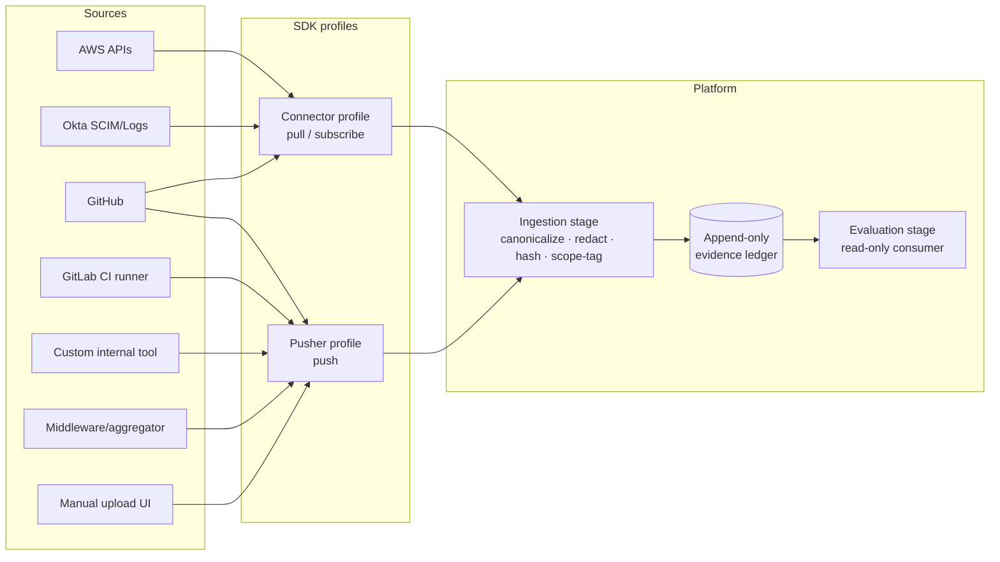

# Evidence SDK

**Companion to** [`ARCHITECTURE_CANVAS.md`](./ARCHITECTURE_CANVAS.md) §4.
**Purpose:** define the contract for getting evidence _into_ the platform from any source — internal cloud APIs, external SaaS, CI/CD pipelines, custom internal tools, middleware, manual upload, anything.

---

## 1. The framing — one ingestion API, two SDK profiles

The evidence ledger (canvas §4.3) is an append-only stream. It has exactly **one** canonical inbound API: `EvidenceIngestService.Push(record) → EvidenceReceipt` — a single gRPC RPC defined in `proto/evidence/v1/evidence.proto`. Everything that produces evidence — first-party connectors, community connectors, CI/CD pipelines, webhooks, manual UI uploads, middleware proxies, ad-hoc CLI invocations — eventually reduces to a call against that endpoint.

The SDK is the contract surface around that endpoint. It supports two **complementary** profiles, not a primary and a fallback. The distinction is about how the connector process retrieves data **from its source**, not about a separate platform-side wire shape:

| Profile                          | Source-side direction | Who initiates the source-side fetch                                       | Use when                                                                                      |
| -------------------------------- | --------------------- | ------------------------------------------------------------------------- | --------------------------------------------------------------------------------------------- |
| **Connector** (pull / subscribe) | Connector → Source    | Connector schedules and queries / subscribes against the source's API     | Source has a stable API and the connector holds credentials to reach it                       |
| **Pusher** (push)                | Source → Connector    | Source initiates and emits to the connector (or directly to the platform) | Source is behind a firewall, ephemeral (CI), event-emitting (webhook), or owns its scheduling |

Both profiles emit to the same platform-side RPC (`EvidenceIngestService.Push`). The profile distinction lives in the connector process's own scheduling, not on the wire — every connector binary (`atlas-aws`, `atlas-github`, `atlas-okta`, `atlas-1password`, `atlas-osquery`, `atlas-jira`, `atlas-manual`) is a long-running process that holds source-side credentials and calls `sdkClient.Push(ctx, record)` against the platform. The platform never reaches outward to a connector to invoke a `Pull` or `Subscribe` RPC; that scheduling is the connector's own concern.

Many real connectors implement **both profiles** — e.g., the GitHub connector pulls org/repo state on a schedule _and_ receives push events from GitHub's webhook subscription. Both flow into the same ledger via the same `Push` call.



The mental model: **the ledger is the system of record; the SDK is how anyone — internal or external, ours or third-party — can credibly write to it.**

---

## 2. Why push needs to be first-class (not an afterthought)

Pull-only architectures (Steampipe-pure, classic Vanta) struggle with a long tail of real evidence:

| Reality                                                                                | Pull-only outcome                                            | Push profile outcome                              |
| -------------------------------------------------------------------------------------- | ------------------------------------------------------------ | ------------------------------------------------- |
| CI/CD runs SAST in a private build cluster, no inbound network                         | "Sorry, no SAST evidence" or "install our agent"             | CI pushes scan results at end of pipeline         |
| The org has a homegrown access-review tool with no API                                 | Manual screenshot upload every quarter                       | Tool emits a JSON push when each review completes |
| Fleet/osquery polling against laptops is one-shot, episodic                            | Either continuous polling burns battery or we miss intervals | Endpoint pushes when state changes                |
| A SaaS only emits webhooks, no polling endpoint                                        | Connector has to fake-poll or scrape                         | Push profile is the natural fit                   |
| A middleware aggregates 5 internal databases for a custom control                      | We rebuild that aggregation in our connector                 | Middleware pushes the already-computed result     |
| Air-gapped systems with one-way data diodes                                            | Impossible to pull                                           | Push from a queue on the protected side           |
| The user's existing telemetry pipeline (Vector, OTEL, Logstash) already moves the data | We duplicate ingestion                                       | Pipeline tees a copy into security-atlas          |

Push is also the **enablement story for non-engineers**: writing a one-line shell command `security-atlas evidence push --kind=...` from a script or a button is dramatically lower-friction than writing a connector. Most organic adoption on the platform will start with push.

---

## 3. Connector profile (pull / subscribe) — the in-process loop

The connector profile is **not** a separate platform-side gRPC surface. It is the internal loop pattern a connector binary follows when it reaches out to its source. The platform never schedules a connector's pull — the connector schedules itself, runs the source-side query (or receives the subscription event), maps the result, and emits to the platform via the canonical `EvidenceIngestService.Push` RPC.

The canonical loop:

```
[ config-load: endpoint, bearer, source-system identity ]
        │
        ▼
[ register: ConnectorRegistryService.Register on startup ]
        │
        ▼
[ auth: produce a vendor-native session for the source ]
        │
        ▼
[ source-side pull | subscribe | webhook-receipt ]
        │
        ▼
[ map: source-record → EvidenceRecord ]
        │
        ▼
[ emit: sdkClient.Push(ctx, record) → Receipt ]
        │
        ▼
[ loop or exit ]
```

The reference implementation is the AWS S3 connector. Read [`connectors/aws/cmd/aws-connector/cmd_run.go`](../connectors/aws/cmd/aws-connector/cmd_run.go) — it inspects each S3 bucket's encryption configuration, maps the result, and pushes one `EvidenceRecord` per (bucket × observation). The whole binary is ~600 LOC; the loop is ~50.

Each connector **declares its source-side fetch direction** at registration time via the `profiles_supported []string` field on `ConnectorRegistryService.Register` — `["pull"]` for scheduled-poll connectors, `["subscribe"]` for event-stream connectors, `["push"]` for webhook-receipt connectors, `["pull", "subscribe"]` for hybrids. This is operator-facing metadata so the platform UI can surface "AWS pulls on a schedule" vs "GitHub also accepts webhooks." It does **not** describe a separate platform-side wire shape — the wire is unconditionally `Push`.

### What does NOT exist on the wire

Earlier drafts of this doc and of canvas §4.1 implied a richer platform → connector gRPC surface with methods like `Describe()`, `AuthMethods()`, `HealthCheck(creds)`, `ListEvidenceKinds()`, `Pull(kind, since, scope_filter)`, `Subscribe(kind, scope_filter)`, and `VerifyProvenance(record)`. **None of those RPCs exist.** Community connector authors should not implement against them, and contributors who land a new connector should not propose them.

The architectural reason: each such RPC would require the platform to schedule and connect _out_ to connectors, moving credentials platform-side and adding scheduling state to the platform. Push-only-on-the-wire keeps credentials in the connector, the platform's surface area minimal, and matches how every modern observability/security platform works (Datadog Agent, OpenTelemetry Collector, GitHub Actions webhook receivers). Connector self-description, health, evidence-kind enumeration, and provenance verification are **per-connector concerns**, surfaced via logs / metrics / per-connector subcommands (`atlas-aws register`, `atlas-aws run`) rather than via a platform-pulled gRPC.

The two RPCs that **do** exist on the connector-management surface are `ConnectorRegistryService.Register` (the connector self-announces at startup) and `ConnectorRegistryService.List` (the operator introspects the live connector set). Full proto: [`proto/connectors/v1/connectors.proto`](../proto/connectors/v1/connectors.proto).

---

## 4. Pusher profile — push API surface

The pusher profile flips control to the source. The pusher has a credential, knows the schema, and pushes records when _it_ decides.

### 4.1 Endpoints

Two transport options, same semantics, both authenticated and tenant-scoped:

| Endpoint                                                        | Use                                                       | Body                                 |
| --------------------------------------------------------------- | --------------------------------------------------------- | ------------------------------------ |
| `POST /v1/evidence:push` (REST/JSON)                            | Maximum reach — works from cURL, any language, CI scripts | One `EvidenceRecord` or batch (≤100) |
| `Push(stream<EvidenceRecord>) → stream<EvidenceReceipt>` (gRPC) | High-throughput push from connectors and middleware       | Streamed records                     |

Both wrap the same internal `IngestEvidence` call. The REST endpoint is the public-facing surface for external pushers.

### 4.2 Push record schema

```jsonc
{
  "idempotency_key": "ci-run-2026-05-10-abc123-step-sast", // required, dedups within a window
  "evidence_kind": "sast.scan_result.v1", // required, must be registered in the schema registry
  "schema_version": "1.0.0", // required, validated against registry
  "control_id": "scf:VPM-04", // required — control or SCF anchor
  "scope": {
    // required — at least one dimension
    "environment": "prod",
    "cloud_account": "aws:111122223333",
    "data_classification": "restricted"
  },
  "observed_at": "2026-05-10T14:23:00Z", // required — when the source observed reality
  "result": "pass", // required — pass | fail | na | inconclusive
  "payload": {
    // schema-validated against evidence_kind
    "tool": "semgrep",
    "tool_version": "1.96.0",
    "ruleset": "p/owasp-top-ten",
    "findings_count": 0,
    "scanned_files": 1247,
    "scan_duration_seconds": 84
  },
  "payload_uri": null, // optional — for large artifacts in object store
  "source_attribution": {
    // who pushed this
    "actor_type": "service_account",
    "actor_id": "ci.gitlab.com/sec-product-co/main",
    "session_id": "<JWT signature reference>"
  }
}
```

**Required fields are required.** The push endpoint rejects records missing any of: `idempotency_key`, `evidence_kind`, `schema_version`, `control_id`, `scope`, `observed_at`, `result`. Provenance is non-negotiable.

### 4.3 Auth model

Pushers authenticate as one of three identity types:

| Identity type       | Credential                                                                                          | Use case                                                        |
| ------------------- | --------------------------------------------------------------------------------------------------- | --------------------------------------------------------------- |
| **Service account** | OIDC token from a trusted IdP (GitHub OIDC, GitLab CI OIDC, AWS IRSA, Workload Identity Federation) | CI runners — short-lived, auditable, no long-lived secrets      |
| **API key (PAT)**   | Long-lived bearer token issued from the platform                                                    | Cron jobs, fixed scripts, middleware where OIDC isn't available |
| **mTLS**            | Client cert from the deployment's PKI                                                               | High-trust internal middleware, air-gapped pushers              |

Every credential is **scoped** at issue time:

- To a tenant (tenant_id)
- To one or more `evidence_kind` values it may push (least-privilege)
- To an optional scope predicate (e.g., "this CI account can only push for `cloud_account=aws:111122223333`")
- To a TTL

The platform refuses pushes that violate scope. The audit log records every push attempt — accepted or rejected — keyed by credential.

### 4.4 Idempotency and replay protection

`idempotency_key` is required and must be unique within a 24-hour window per tenant. Duplicate pushes return the original `EvidenceReceipt` without writing again. This makes retry safe — a CI step that fails halfway and retries does not produce two evidence records.

Tamper detection: every accepted record is hashed (sha256 of canonical form). The receipt includes this hash. Re-pushing a record with the same `idempotency_key` but different content is **rejected**, not silently overwritten.

### 4.5 Schema registry

`evidence_kind` is the contract. Each kind has:

- A stable identifier (`sast.scan_result.v1`, `access_review.completion.v1`, `manual.attestation.v1`).
- A JSON Schema for the payload.
- An owner (`platform` for first-party, `community/<repo>` for community contributions, `org-private` for tenant-local kinds).
- Default SCF anchor mappings (which SCF anchors this kind of evidence typically applies to).
- A semver — kinds evolve via additive minor versions; breaking changes go through major versions with a deprecation window.

The schema registry is itself a tenant-scoped resource: organizations can add private `evidence_kind` values for their custom internal tools without touching the global namespace.

This is the OpenTelemetry-semantic-conventions analog. The registry exists to prevent the connector ecosystem from devolving into "every pusher invents its own JSON shape."

### 4.6 Rate limiting and back-pressure

Push endpoints are rate-limited per credential and per tenant:

- **Soft limit** (token bucket): 100 records/second per credential by default, configurable.
- **Hard tenant limit**: protects the ingestion stage from a runaway pusher exhausting downstream capacity.
- **429 with `Retry-After`** on overage. The reference SDK respects this and exponential-backs-off.

The ingestion stage between the push endpoint and the ledger uses NATS JetStream (canvas §9.3) for durable buffering — pushes acknowledge as soon as the record is committed to the stream, not after evaluation. This decouples write latency from any downstream evaluation cost.

### 4.7 Provenance and the audit trail

Every push results in an `EvidenceRecord` with `provenance` populated:

```jsonc
{
  "ingestion_path": "push", // vs "pull" or "subscribe"
  "credential_id": "sa:gitlab-ci.sec-product",
  "credential_type": "oidc_service_account",
  "ip_address_class": "vpn-egress", // anonymized to class, not raw IP unless config requires
  "received_at": "2026-05-10T14:23:01.842Z",
  "push_endpoint_version": "v1",
  "schema_version": "1.0.0",
  "validated_against": "sha256:<schema-hash>"
}
```

When an auditor asks "where did this evidence come from?", the answer is precise.

---

## 5. The middleware story

The middleware pattern is a first-class deployment shape. Examples:

### 5.1 Aggregating middleware

A team has 5 internal databases that together describe "who has access to what." None individually is the source of truth. A small middleware service runs the join, computes the answer, and pushes one canonical record:

```
[ DB1 · users ]    [ DB2 · groups ]    [ DB3 · entitlements ]
        \                 |                  /
         \                |                 /
          → middleware (joins, computes ACL summary) →
                           |
                           ▼
                push record (kind: org.acl_summary.v1)
                           ▼
                  security-atlas ledger
```

The middleware is **not** a connector — it's a tenant-internal service the user owns and operates. The platform doesn't see the upstream databases at all. It only sees the canonical pushed record.

### 5.2 Telemetry-tap middleware

The org runs Vector / Fluent Bit / OpenTelemetry collectors for SRE observability. Adding security-atlas as a destination tee gives evidence ingestion for free:

```
existing log/event stream → Vector → [SIEM, security-atlas push, S3]
```

A small Vector transform reshapes events into the security-atlas push schema. Zero net new infrastructure.

### 5.3 Air-gapped one-way bridge

In a regulated network, a one-way data diode forwards push records out of the protected zone:

```
[ protected zone with sensitive systems ]
       │
       ▼ (push records over diode)
[ DMZ relay → security-atlas push endpoint ]
```

Pull is impossible across the diode; push is the only viable direction. This is the case for some defense, healthcare, and OT environments.

### 5.4 Cross-cluster federation

A multi-cloud / multi-cluster deployment runs lightweight pusher daemons in each region, all forwarding to a central security-atlas. Each pusher is a service-account-authenticated push client.

---

## 6. The push CLI

Friction kills adoption. The reference CLI ships with the platform:

```sh
# One-shot push from a CI step
security-atlas evidence push \
  --kind sast.scan_result.v1 \
  --control scf:VPM-04 \
  --scope environment=prod,cloud_account=aws:111122223333 \
  --observed-at "$(date -u +%FT%TZ)" \
  --result pass \
  --payload @semgrep-output.json \
  --idempotency-key "${CI_PIPELINE_ID}-${CI_JOB_ID}"

# Bulk push from a file
security-atlas evidence push --batch records.ndjson

# Dry-run (validate against schema, don't write)
security-atlas evidence push --dry-run --kind ... --payload @file.json
```

Auth: the CLI auto-detects environment for OIDC tokens (GitHub Actions, GitLab CI, Buildkite, CircleCI), falls back to `SECATLAS_API_KEY` env var, then to a config file.

---

## 7. SDKs (libraries)

Push SDKs ship for the languages where the friction matters:

| Language          | Use                                                | Status target                |
| ----------------- | -------------------------------------------------- | ---------------------------- |
| Go                | First-party, used inside connectors and middleware | v1                           |
| Python            | Data-engineering / ML pipelines                    | v1                           |
| TypeScript / Node | Cloudflare Workers, Vercel, edge functions         | v1                           |
| Bash / cURL       | Universal CI escape hatch                          | v1 (the CLI covers this)     |
| Java / Kotlin     | Enterprise embed                                   | v2                           |
| Rust              | High-perf agents                                   | v2 (community-driven likely) |

Each SDK exposes the same surface: `client.evidence.push(record)`, `client.evidence.push_batch([...])`, schema validation client-side before transport, automatic retry/backoff, structured errors.

---

## 8. Receiving from external webhooks

A common case: a SaaS only emits webhooks. Examples — GitHub repo events, Linear issue events, Datadog monitor changes, Jamf device check-in events, Slack audit log forwarding.

Webhook receipt is **a thin shim into the push endpoint**:

```
SaaS webhook
   │
   ▼
HTTP receiver (signature-verified, source-attributed)
   │
   ▼ transform to canonical EvidenceRecord
   ▼
internal IngestEvidence call (same code path as push)
   │
   ▼
ledger
```

This means: every connector that supports webhook input is, internally, just a pre-authenticated push transformer. Subscribe-via-webhook and explicit push converge on one code path.

---

## 9. Push security threat model (because the user is a security-product startup)

Push is a privileged operation. The threat model is explicit:

| Threat                                               | Mitigation                                                                                                                                         |
| ---------------------------------------------------- | -------------------------------------------------------------------------------------------------------------------------------------------------- |
| Attacker forges evidence to fake compliance          | Credential auth + scope-pinning + signed receipts; pushes outside the credential's scope are rejected                                              |
| Compromised CI credential is used to flood ingestion | Per-credential rate limits + alerting on anomalous push rate                                                                                       |
| Replay of an old push to backdate evidence           | `observed_at` is in the payload; ingestion stage clamps `observed_at` to a max-skew window from `received_at`; replay detected via idempotency key |
| Push of evidence outside the expected schema         | Schema registry validation rejects on ingest                                                                                                       |
| Push that overwrites/contradicts pulled evidence     | Pulled and pushed evidence are different records in the ledger; evaluation can prefer one source explicitly per `evidence_kind` configuration      |
| Side-channel via payload contents (PII, secrets)     | Ingestion stage runs configurable redaction rules per `evidence_kind` before write                                                                 |
| Compromised pusher pushes for another tenant         | Tenant scoping at credential issue + Postgres RLS at the ledger layer (canvas §5.4) — defense in depth                                             |

The audit log retains every accepted _and_ rejected push. A would-be attacker leaves traces.

---

## 10. Anti-patterns we explicitly reject

| Anti-pattern                                    | Why we reject                                                                                                     |
| ----------------------------------------------- | ----------------------------------------------------------------------------------------------------------------- |
| **Anonymous push**                              | No identity = no audit trail = evidence is worthless                                                              |
| **Schemaless push**                             | Arbitrary JSON in the ledger turns evaluation into vibes                                                          |
| **Auto-promote ad-hoc kinds to global schemas** | Forces schema discipline; ad-hoc tenant-local schemas are first-class but stay local until explicitly contributed |
| **Push overwrites pull**                        | Two records, two provenance trails; the evaluation engine decides precedence per kind                             |
| **Push without scope**                          | Scope is mandatory; "global" pushes are a footgun                                                                 |
| **Skip-validation push for performance**        | Schema validation is on the hot path; if it's too slow we make validation faster, we don't bypass it              |

---

## 11. What changes elsewhere in the architecture

The push profile interacts with several other parts of the canvas:

- **§4.2 Connector roster** — connectors that support webhook input now declare it as the `subscribe`/`push` capability explicitly. CI/CD systems (GitHub Actions, GitLab CI, Buildkite) graduate to first-class push sources, not external curiosities.
- **§4.3 Ingestion vs. evaluation** — the diagram is unchanged: push goes through the same canonicalize/redact/hash/scope-tag pipeline as pull. Evaluation has no idea (and shouldn't) which path delivered the record.
- **§5.4 Tenant isolation** — push credentials are tenant-scoped at issue time; the audit log of pushes is RLS-protected.
- **§9.3 Event/queue layer** — NATS JetStream is the durable buffer between push acceptance and ledger commit; this is what makes push acks fast even when downstream is busy.
- **§9.4 Plugin architecture** — pushers are not plugins. They are external clients of a public API. This means pushers don't need to be installed in the deployment to work — a hard property for adoption.
- **§11 Open questions** — adds the schema-registry governance question and the auth-credential issuance UX question.

---

## 12. Roadmap placement

| Phase  | What ships                                                                                                                                                                                                                                                                                                                                                                        |
| ------ | --------------------------------------------------------------------------------------------------------------------------------------------------------------------------------------------------------------------------------------------------------------------------------------------------------------------------------------------------------------------------------- |
| **v1** | REST `POST /v1/evidence:push` endpoint, schema registry (platform + tenant-private kinds), CLI, OIDC + API key auth, idempotency, rate limiting, signed receipts, audit log. Go and Python SDKs. ~10 platform `evidence_kind` schemas (sast, sca, container scan, manual attestation, access review completion, change ticket, vuln scan, deploy event, ci pipeline run, custom). |
| **v2** | gRPC streaming push, TypeScript and Java SDKs, mTLS auth, webhook receivers as first-class connectors for top SaaS (GitHub, GitLab, Linear, Datadog, Slack), schema-registry contribution flow (community kinds), redaction policy editor.                                                                                                                                        |
| **v3** | Federation (one security-atlas pushes to another), schema-evolution tooling (semver enforcement, deprecation tracking), pusher fleet management UI, advanced provenance (Sigstore signing of pushed payloads).                                                                                                                                                                    |

---

## References

- [NATS JetStream — durable streaming](https://docs.nats.io/nats-concepts/jetstream)
- [GitHub OIDC for Actions](https://docs.github.com/en/actions/deployment/security-hardening-your-deployments/about-security-hardening-with-openid-connect)
- [GitLab CI OIDC](https://docs.gitlab.com/ee/ci/cloud_services/)
- [OpenTelemetry semantic conventions](https://opentelemetry.io/docs/specs/semconv/) — model for the schema registry pattern
- [Sigstore / cosign](https://www.sigstore.dev/) — relevant for v3 signed-payload provenance
