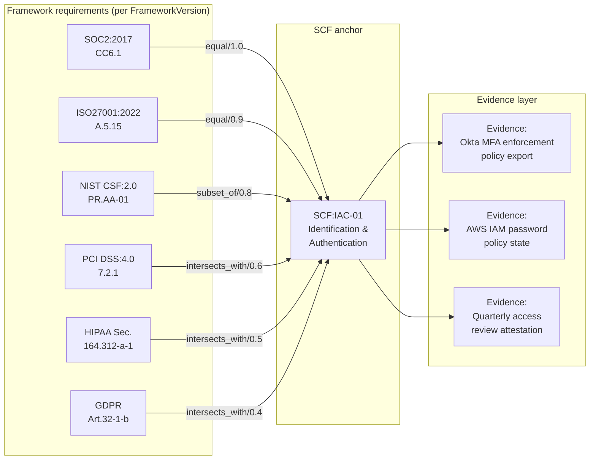
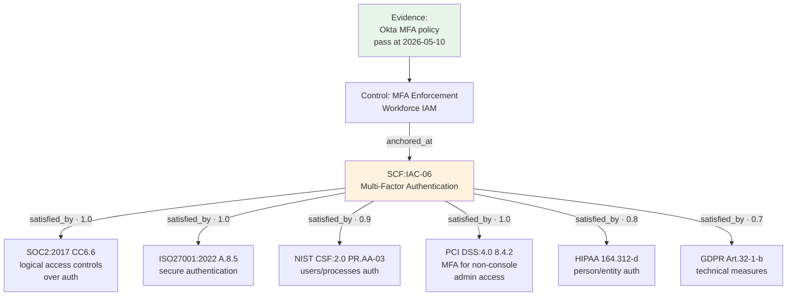
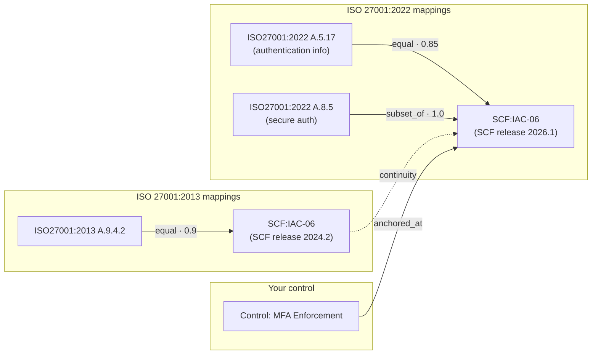
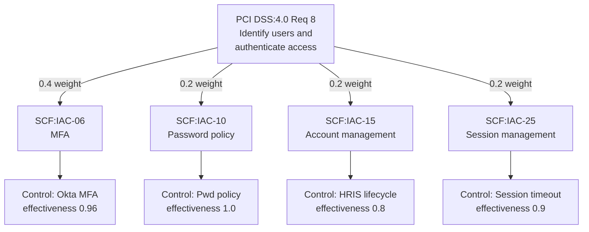

# Unified Control Framework — Graph Model

**Companion to** [`ARCHITECTURE_CANVAS.md`](./ARCHITECTURE_CANVAS.md) §3.
**Purpose:** make the "graph, not spreadsheet" claim concrete with diagrams, a worked example, and explicit semantics.

---

## 1. Why a graph at all

Existing GRC tools maintain framework crosswalks as flat tables: pairs of `(control_in_framework_A, control_in_framework_B)`. Three things break with that approach:

1. **N:M relationships get rounded to 1:1.** A real ISO 27001 control often relates to 3 SOC 2 criteria and 2 NIST 800-53 controls. Flat tables force the modeler to pick the closest match, losing the others.
2. **Mappings decay with each framework version.** ISO 27001:2013 → :2022 reorganized the entire annex. Every flat-table mapping pointing at `ISO27001.A.9.4.2` rots. There's no place to express "this requirement was renamed and split into A.5.15 + A.8.5."
3. **The relationship type is lost.** "Equal" and "intersects with partial coverage" get treated identically, so a check-the-box dashboard reports green when it should report partial.

The graph model fixes all three by inserting a **semantic spine** — the SCF anchor — between framework requirements, and labeling every edge with a **NIST IR 8477 STRM relationship type and strength**.

---

## 2. The conceptual model



Three node types. Two layers of edges. That's the whole model.

- **Framework requirement nodes** belong to a specific `FrameworkVersion`. They are immutable once published.
- **SCF anchors** are the semantic equivalence classes — "this is the underlying control concept."
- **Evidence records** attach to SCF anchors via the `Control` entity (controls are the operational instance — see canvas §2.1).

Framework-to-framework relationships are never modeled directly. They are always **derived through an SCF anchor**. This is what keeps the graph coherent under versioning.

---

## 3. Worked example — one piece of evidence, six framework satisfactions

The strongest case for the graph is the most common case in practice: you implement MFA, and you want it to count for everything it actually covers.

### 3.1 The setup

You enforce MFA in Okta for all users. The Okta connector emits an evidence record once a day:

```
EvidenceRecord {
  id: "evt-2026-05-10T08:00:00Z-okta-mfa-policy"
  control_id: "<your-internal-MFA-control-id>"
  scope_id: "scope:prod-us"
  observed_at: "2026-05-10T08:00:00Z"
  result: "pass"
  payload: {
    policy_name: "Require MFA for all users",
    enforcement: "mandatory",
    factor_types: ["webauthn", "totp"],
    user_coverage: 0.99,  // 99% of active users have enrolled
    last_review: "2026-04-12"
  }
  hash: "sha256:..."
}
```

Your internal `Control` named `MFA Enforcement (Workforce IAM)` is anchored at `SCF:IAC-06` ("Multi-Factor Authentication"). 

### 3.2 What the graph computes



**One evidence record. Six framework requirements satisfied at varying strengths.**

The traversal is computed at evaluation time:

```
For a given Control C anchored at SCF:X:
  for each FrameworkRequirement FR with edge (FR -> SCF:X):
    coverage_of(FR, C) = strength(FR -> SCF:X) * effectiveness(C)
```

Where `effectiveness(C)` is the rolling pass rate of evidence over the freshness window (canvas §6.2).

### 3.3 What the UI shows

A user opens the SOC 2 dashboard and sees `CC6.6` is at **96% coverage**. They drill down:

- The control is satisfied through `SCF:IAC-06` (MFA), strength `1.0` (equal).
- Effectiveness of the underlying `MFA Enforcement` control is `0.96` over the last 30 days.
- Coverage = `1.0 * 0.96 = 0.96`.
- Click through to the underlying evidence stream. See the 30 daily Okta evidence records, including the one day last week where coverage dipped to 0.94 because two new hires hadn't enrolled yet.

A user opens the GDPR dashboard. The same `MFA Enforcement` control covers `Art.32-1-b` at `0.7 * 0.96 = 0.67`. The UI flags this as "partial — supplement with additional evidence" and surfaces other SCF anchors that also map to `Art.32-1-b` (encryption, pseudonymization, access logging) as suggested coverage to fill the gap.

**This is the daily payoff of the graph.** No user ever maintains a SOC 2-vs-GDPR mapping by hand. They author one control, anchor it once, and the graph propagates.

---

## 4. STRM relationship types — what each one means

NIST IR 8477 ([Set Theory Relationship Mapping](https://csrc.nist.gov/pubs/ir/8477/final)) defines five edge labels. Each carries a **strength** float in `[0.0, 1.0]` reflecting auditor confidence in the mapping.

```mermaid
graph LR
    subgraph "equal"
        A1[Req A] <-- "1.0" --> A2[SCF anchor]
    end
    subgraph "subset_of"
        B1[Req B] -- "is fully<br/>covered by" --> B2[SCF anchor]
    end
    subgraph "superset_of"
        C1[Req C] -- "covers more than" --> C2[SCF anchor]
    end
    subgraph "intersects_with"
        D1[Req D] -.->|partial| D2[SCF anchor]
    end
    subgraph "no_relationship"
        E1[Req E] -.x.- E2[SCF anchor]
    end
```

| Type | Meaning | Coverage rule | Example |
|------|---------|---------------|---------|
| `equal` | Source and target describe the same concept. | `coverage = strength * effectiveness` | `SOC2:CC6.6 equal SCF:IAC-06` |
| `subset_of` | Source is fully covered by target — target is broader. | `coverage = strength * effectiveness` (full credit) | `SOC2:CC6.6 subset_of SCF:IAC-06` (SCF concept includes MFA + risk-based auth + step-up) |
| `superset_of` | Source covers more than target — only partial credit. | `coverage = strength * effectiveness * scaling_factor` | `SCF:IAC-06 superset_of NIST_CSF:PR.AA-03` (CSF is narrower) |
| `intersects_with` | Partial overlap; supplemental evidence needed for full coverage. | `coverage = strength * effectiveness` and UI flags as partial | `GDPR:Art.32 intersects_with SCF:IAC-06` |
| `no_relationship` | Confirmed *no* overlap. Stored as data to suppress false suggestions. | `coverage = 0` | `PCI:9.4 no_relationship SCF:IAC-06` (physical access ≠ MFA) |

**Why store `no_relationship` explicitly?** Because the alternative is "absence of an edge", which the graph engine cannot distinguish from "we haven't gotten around to mapping this yet." Storing the negative is the difference between "we know this isn't relevant" and "we don't know."

---

## 5. Versioning — how the graph survives framework updates

Framework versions are **immutable, additive nodes**. Mappings are **pinned to a specific FrameworkVersion AND a specific SCF release**.



The migration story when you upgrade from ISO 27001:2013 to :2022:

1. New `FrameworkVersion` row created: `ISO27001:2022`, status `current`.
2. Old `FrameworkVersion` `ISO27001:2013` flips to status `legacy` (not deleted; historical audit replay needs it).
3. The mapping ingest job pulls the new SCF crosswalk (SCF re-publishes whenever a major framework changes).
4. A `framework_version_migration` job suggests likely 1:1 carries (e.g., `A.9.4.2 → A.8.5`) and flags everything else for human review.
5. Your `Control` is unchanged. Only its inbound edges from framework requirements move.

**Crucial property:** historical evidence still computes coverage correctly under the old framework version because mappings are version-pinned. An auditor in 2027 reviewing 2024 evidence sees the 2013 view of ISO 27001 — not the 2022 view retroactively applied.

---

## 6. Coverage strength propagation — multi-control requirements

Most framework requirements are **broad** and need multiple SCF anchors to fully cover. PCI DSS 8 (Identification & Authentication) is satisfied by MFA *and* password policy *and* account lifecycle *and* session management.



Coverage is the **weighted sum of anchor coverage**, weighted by the framework's allocation of "what fraction of this requirement is about each anchor":

```
coverage(REQ) = Σ (weight_i * coverage(anchor_i))
              = 0.4*0.96 + 0.2*1.0 + 0.2*0.8 + 0.2*0.9
              = 0.91
```

The weights come from **the SCF crosswalk itself** (when SCF publishes them) or from **the user's tuning** when not. Conservative default: equal weights across all anchors mapped to a requirement.

This is the foundation for the dashboard's "PCI is at 91%" number being a real number, not a vibe.

---

## 7. Bidirectional traversal — the two daily questions

The graph is queried in two directions, all day, every day:

### 7.1 "What does my evidence cover?" (forward traversal)

`Evidence → Control → SCF anchor → FrameworkRequirements`

Use cases:
- After ingest, what new framework satisfactions just lit up?
- A new evidence record arrived with a `fail` result — what frameworks just degraded?
- An exception was approved — what coverage just changed?

### 7.2 "What do I need to satisfy this requirement?" (reverse traversal)

`FrameworkRequirement → SCF anchor(s) → Control(s) → Evidence`

Use cases:
- A SOC 2 auditor asks for evidence of `CC6.1` — what evidence do we have?
- We're scoping ISO 27001 — what controls do we need to author for `A.8.5`?
- We're missing coverage on `HIPAA 164.312-d` — which SCF anchors map to it that we don't yet have controls for?

Both are graph traversals, both are O(small) given the fan-out is bounded (a typical requirement maps to 1–6 anchors, an anchor maps to 1–8 framework requirements).

---

## 8. Storage and query — Postgres (not Neo4j)

A common reaction to "graph model" is "use a graph database." We don't, for v1.

The graph is **small** (low thousands of nodes, low tens-of-thousands of edges, even with all six framework versions and SCF). It is **read-heavy and rarely-mutated** — mappings change quarterly, not daily. It has **no need for property-graph features beyond labeled edges with attributes**.

**Postgres + adjacency tables + recursive CTEs handles this cleanly:**

```
framework_versions(id, framework_id, version, status, oscal_catalog_uri)
framework_requirements(id, framework_version_id, code, title, body)
scf_anchors(id, scf_id, family, title)
scf_release(id, version, published_at)

-- The mapping graph
fw_to_scf_edges(
  framework_requirement_id,
  scf_anchor_id,
  scf_release_id,
  relationship_type enum,  -- equal, subset_of, ...
  strength float,
  weight float,
  source_attribution text   -- 'SCF official' | 'community' | 'org-internal'
)

-- Operational
controls(id, scf_anchor_id, ...)
evidence_records(id, control_id, ...)
```

A coverage query is a recursive CTE walking `evidence → controls → scf_anchors → fw_to_scf_edges → framework_requirements`, aggregated per requirement. Indexed appropriately, this returns in milliseconds for the typical org.

If we ever do hit 10⁶+ edges or property-graph traversal patterns we don't have today, swapping to Apache AGE (Postgres extension exposing Cypher), KuzuDB, or Neo4j is a contained change — only the traversal layer needs to know.

---

## 9. Editability — when users diverge from SCF

SCF is the *default* spine, but no real org's controls match SCF exactly. The graph supports three escape hatches:

1. **Add a new SCF-shaped anchor.** Users define `org-anchors:custom-X` with the same interface. Same edges, same traversal, same coverage math. Used when SCF lacks a concept.
2. **Override an SCF mapping for your tenant.** A user disagrees that `SCF:IAC-06 equal SOC2:CC6.6` for their context — they edit the edge type/strength locally. The override is per-tenant; the SCF default is untouched.
3. **Map directly between framework requirements.** Discouraged but supported. Used when no SCF anchor fits and authoring an org-anchor is overkill. Marked clearly in the UI as a "direct mapping" so the maintenance debt is visible.

All three are first-class graph operations; none of them break the traversal.

---

## 10. What this means in the UI

The diagrams above are not just for engineers. The user-facing UI exposes the graph in three places:

1. **Control detail view** — show the SCF anchor, the framework requirements satisfied, and the live coverage strength to each. Click any framework requirement to see what other anchors also feed it.
2. **Framework dashboard** — for each requirement, show the contributing anchors and controls, with the weighted coverage breakdown (pie / stacked bar). Click into a low-coverage requirement to see where the gap is.
3. **Mapping inspector** — admin view for reviewing/editing the graph. Show nodes, edges, types, strengths, source attribution. Edit local overrides. Surface conflicts (e.g., SCF says `equal/0.9`, your override says `intersects/0.5` — explain why).

The graph being legible to humans, not just to the engine, is the difference between "this is a clever data model" and "this is the actual product."

---

## References

- [NIST IR 8477 — Set Theory Relationship Mapping (STRM)](https://csrc.nist.gov/pubs/ir/8477/final)
- [Secure Controls Framework download](https://securecontrolsframework.com/scf-download/) — published as Excel + JSON + OSCAL
- [SCF on GitHub](https://github.com/securecontrolsframework/securecontrolsframework)
- [NIST OSCAL specification](https://pages.nist.gov/OSCAL/)
- [Apache AGE — Postgres graph extension](https://age.apache.org/) (path of least resistance if we ever outgrow recursive CTEs)
