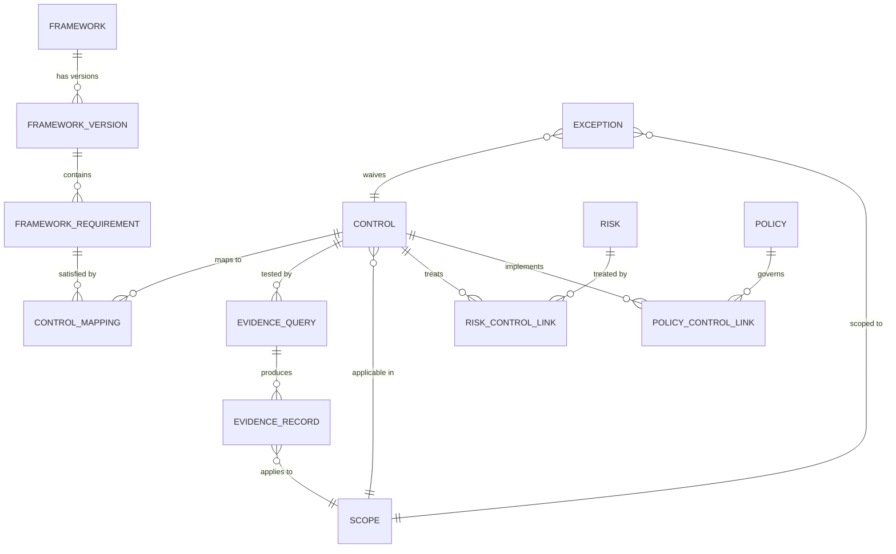

**security-atlas canvas** · [← index](../ARCHITECTURE_CANVAS.md)

---

# 2. Domain Primitives

The data model is small on purpose. Six entities carry most of the weight; everything else is a relationship.

## 2.1 Control

| Field                                 | Type            | Notes                                                                     |
| ------------------------------------- | --------------- | ------------------------------------------------------------------------- |
| `id`                                  | string (UUIDv7) |                                                                           |
| `scf_id`                              | string          | Canonical SCF code (e.g. `IAC-01`). Optional but strongly recommended.    |
| `title`                               | string          |                                                                           |
| `description`                         | text            |                                                                           |
| `control_family`                      | enum            | SCF taxonomy: AAA, AST, BCD, CFG, CHG, CLD, CPL, CRY, ...                 |
| `implementation_type`                 | enum            | `automated` \| `semi_automated` \| `manual_attested` \| `manual_periodic` |
| `owner_role`                          | string          | Who owns it (RACI).                                                       |
| `lifecycle_state`                     | enum            | `draft` → `proposed` → `active` → `deprecated` → `retired`                |
| `applicability_expr`                  | DSL             | A boolean over scope dimensions; see [§5 Scopes](./05-scopes.md).         |
| `evidence_query_ids[]`                | array           | Links to evidence queries.                                                |
| `policy_ids[]`                        | array           | Linked policies.                                                          |
| `created_at`, `updated_at`, `version` | meta            | Soft-versioned; full history retained.                                    |

Controls are **first-class** whether automated or manual. A `manual_attested` control still has lifecycle, ownership, evidence (uploaded artifact), and freshness — it is not a degraded automated control.

## 2.2 Risk

A risk is a _statement of plausible loss_, not a control failure. Controls _treat_ risks; risks are not derived from controls. We support multiple methodologies behind a common surface.

| Field                        | Type      | Notes                                                                                                           |
| ---------------------------- | --------- | --------------------------------------------------------------------------------------------------------------- |
| `id`, `title`, `description` |           |                                                                                                                 |
| `category`                   | enum      | `confidentiality` \| `integrity` \| `availability` \| `privacy` \| `regulatory` \| `operational` \| `financial` |
| `methodology`                | enum      | `nist_800_30` \| `fair` \| `cis_ram` \| `iso_27005` \| `qualitative_5x5`                                        |
| `inherent_score`             | jsonb     | Methodology-specific (FAIR has LEF/LM; NIST has likelihood/impact 1–5).                                         |
| `treatment`                  | enum      | `accept` \| `mitigate` \| `transfer` \| `avoid`                                                                 |
| `treatment_owner`            | string    |                                                                                                                 |
| `linked_control_ids[]`       | array     | Many-to-many.                                                                                                   |
| `residual_score`             | jsonb     | Computed; see [§6 Risk Register Linkage](./06-risk.md).                                                         |
| `review_due_at`              | timestamp |                                                                                                                 |

**Default methodology: NIST 800-30 qualitative**, because it is the lowest common denominator most auditors and regulators expect. FAIR is supported for orgs that have invested in it. Methodology is a per-risk field, not global, so they coexist.

## 2.3 Evidence

An evidence record is _a single observation about reality at a point in time_. Provenance is mandatory; no anonymous evidence.

| Field               | Type        | Notes                                                                     |
| ------------------- | ----------- | ------------------------------------------------------------------------- |
| `id`                | UUIDv7      | Time-ordered.                                                             |
| `evidence_query_id` | uuid        | What query produced it.                                                   |
| `control_id`        | uuid        | Indexed; many evidence records per control.                               |
| `scope_id`          | uuid        | Which scope cell this applies to.                                         |
| `observed_at`       | timestamptz | When the underlying system state was observed.                            |
| `ingested_at`       | timestamptz | When we received it.                                                      |
| `provenance`        | jsonb       | Connector ID, source system ID, source record key, query hash, runner ID. |
| `result`            | enum        | `pass` \| `fail` \| `na` \| `inconclusive`                                |
| `payload`           | jsonb       | Raw observation (redacted per policy).                                    |
| `payload_uri`       | string      | For large artifacts (S3-compatible).                                      |
| `hash`              | string      | sha256 of payload — used for dedup and tamper detection.                  |
| `freshness_class`   | enum        | See below.                                                                |
| `valid_until`       | timestamptz | When this record is no longer current.                                    |

**Freshness model** — different controls have different acceptable evidence ages. Freshness is a property of the _control_, applied to its evidence:

| Class       | Max age | Example controls                                |
| ----------- | ------- | ----------------------------------------------- |
| `realtime`  | 24 h    | Production firewall config, prod IAM root usage |
| `daily`     | 7 d     | EDR coverage, MFA enforcement                   |
| `weekly`    | 30 d    | Vulnerability scan results                      |
| `monthly`   | 90 d    | Access review, vendor security questionnaire    |
| `quarterly` | 120 d   | DR test, tabletop exercise                      |
| `annual`    | 400 d   | Penetration test, policy reaffirmation          |

Records past `valid_until` are **stale**, not deleted. Stale evidence drives a `drift` signal; the historical record is preserved for point-in-time audit replay.

## 2.4 Scope (multidimensional)

Scope is **not** a tree. It is a coordinate in an N-dimensional space. The platform ships with a default dimension set; orgs can add dimensions.

| Dimension             | Default values                                               |
| --------------------- | ------------------------------------------------------------ |
| `business_unit`       | org-defined                                                  |
| `environment`         | `prod` \| `staging` \| `dev` \| `sandbox`                    |
| `geography`           | ISO 3166 country codes / regions                             |
| `cloud_account`       | per cloud — AWS account, GCP project, Azure sub, K8s cluster |
| `data_classification` | `restricted` \| `confidential` \| `internal` \| `public`     |
| `product_line`        | org-defined                                                  |

A **scope cell** is a tuple `(bu, env, geo, cloud, dc, product)`. Controls have an `applicability_expr` — a boolean over dimensions. Example: `environment IN ('prod','staging') AND data_classification IN ('restricted','confidential')`.

## 2.5 Framework and FrameworkVersion

These are deliberately separate. `Framework` is `ISO 27001`; `FrameworkVersion` is `ISO 27001:2022` vs `ISO 27001:2013`. Mappings are version-pinned. Upgrading a framework version is an explicit migration, not an in-place mutation.

| Framework field                | Notes                       |
| ------------------------------ | --------------------------- |
| `id`, `name`, `slug`, `issuer` | `iso_27001`, ISO/IEC        |
| `description`                  |                             |
| `latest_version_id`            | Pointer to current default. |

| FrameworkVersion field           | Notes                                |
| -------------------------------- | ------------------------------------ |
| `framework_id`                   |                                      |
| `version`                        | `2022`, `r5`, `v4`, `2024`           |
| `effective_from`, `effective_to` |                                      |
| `status`                         | `current` \| `legacy` \| `withdrawn` |
| `requirement_count`              | denormalized                         |
| `oscal_catalog_uri`              | If we have an OSCAL ingest of it.    |

## 2.6 Policy

Policies are governance documents that reference controls (the inverse of "controls implement policies"). A policy without a linked control is a Word doc; a control without a linked policy is engineer cargo culting.

| Field                                      | Notes                                                                  |
| ------------------------------------------ | ---------------------------------------------------------------------- |
| `id`, `title`, `version`, `effective_date` | Policies are heavily versioned.                                        |
| `body_md`                                  | Markdown source; rendered to PDF for attestation.                      |
| `owner`, `approver`                        | RACI on the policy itself.                                             |
| `acknowledgment_required_role[]`           | Roles whose members must attest annually.                              |
| `linked_control_ids[]`                     | What controls it governs.                                              |
| `status`                                   | `draft` \| `under_review` \| `approved` \| `published` \| `superseded` |

---

[← Canvas index](../ARCHITECTURE_CANVAS.md) · [← 1. Vision](./01-vision.md) · **Next:** [3. Unified Control Framework →](./03-ucf.md)
