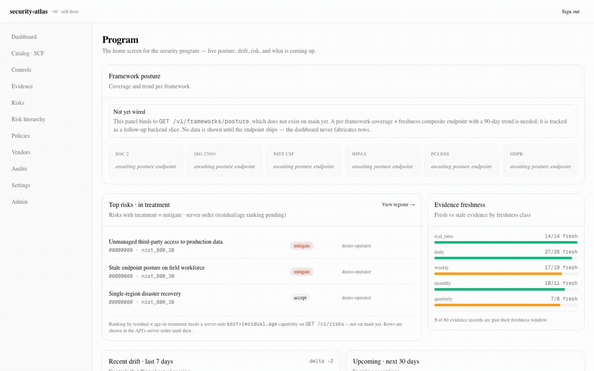

# security-atlas

[](./LICENSE)
[](https://github.com/mgoodric/security-atlas/actions/workflows/ci.yml)
[](https://codecov.io/gh/mgoodric/security-atlas)
[](https://github.com/mgoodric/security-atlas/releases/latest)

<picture>
  <source media="(prefers-color-scheme: dark)" srcset="./docs/images/hero-dashboard-dark.png">
  <source media="(prefers-color-scheme: light)" srcset="./docs/images/hero-dashboard.png">
  
</picture>

Open-source, self-hostable GRC platform — a control-graph and evidence-pipeline that lets a single security program operate against many frameworks (SOC 2, ISO 27001, NIST CSF, PCI DSS, HIPAA, GDPR) from one source of truth.

The spine is the [Secure Controls Framework](https://securecontrolsframework.com/) (~1,400 controls crosswalked to 200+ frameworks via NIST IR 8477 STRM). The wire format is NIST OSCAL. The target user is the solo security leader at a 50–150-person security-product startup who runs the entire program — risk register, board reporting, SOC 2, vendor reviews, policies, exceptions — alone.

**Early implementation.** 32 of 58 v1 slices are merged on `main`. See [`Plans/ARCHITECTURE_CANVAS.md`](./Plans/ARCHITECTURE_CANVAS.md) for the design canvas and [`docs/issues/_INDEX.md`](./docs/issues/_INDEX.md) for the slice backlog.

---

## Why security-atlas

Existing GRC tools optimize for the first-SOC-2-in-90-days SMB sale. They model controls per-framework, store evidence in a vendor cloud, and the Year-2 renewal cliff is well-documented.

security-atlas inverts the model:

- **One control, N framework satisfactions.** The Unified Control Framework is a graph with STRM-typed edges through SCF anchors. Never duplicate controls per framework.
- **Append-only evidence ledger.** Ingestion and evaluation are separated stages; evaluation never writes to source-of-truth evidence. Point-in-time replay is always possible.
- **Self-hostable from day one.** Single mid-size VM runs the whole platform. NATS JetStream (single binary) · Postgres · S3-compatible artifact store.
- **OSCAL-native.** Ingest catalogs / profiles / component-definitions; export SSP / AP / AR / POA&M.

---

## Screenshots

Captured from the running app with seeded demo data — `just refresh-screenshots` regenerates them. Light and dark variants below; the page selects per `prefers-color-scheme`.

### Control detail — UCF crosswalks

One control, N framework satisfactions. STRM-typed edges through an SCF anchor.

<picture>
  <source media="(prefers-color-scheme: dark)" srcset="./docs/images/control-detail-dark.png">
  <source media="(prefers-color-scheme: light)" srcset="./docs/images/control-detail.png">
  
</picture>

### Audit workspace — frozen audit period

The auditor's surface. Period header with frozen-at timestamp; sampling, walkthrough, and comments tabs per control.

<picture>
  <source media="(prefers-color-scheme: dark)" srcset="./docs/images/audit-workspace-dark.png">
  <source media="(prefers-color-scheme: light)" srcset="./docs/images/audit-workspace.png">
  
</picture>

### Board pack preview — the quarterly artifact

The v1 binary success-test artifact. Templated narrative per section, per-section approval, frozen on publish.

<picture>
  <source media="(prefers-color-scheme: dark)" srcset="./docs/images/board-pack-preview-dark.png">
  <source media="(prefers-color-scheme: light)" srcset="./docs/images/board-pack-preview.png">
  
</picture>

### What it looks like in motion

Short walk-through: dashboard, then a drill into a control to see UCF coverage.



---

## Install

```sh
# clone
git clone https://github.com/mgoodric/security-atlas.git
cd security-atlas

# bring up local Postgres + apply migrations
just db-up
just migrate-up

# build everything
just build
```

Detailed local dev setup, prerequisites, and the full `just` recipe surface live in [`CONTRIBUTING.md`](./CONTRIBUTING.md).

### Your first sign-in (self-host)

The platform mints a one-time bootstrap admin bearer at startup. The `/login` page detects fresh-install state and shows three orthogonal ways to find the token:

- **docker-compose:** `docker compose logs atlas 2>&1 | grep BOOTSTRAP_TOKEN`
- **Helm:** `kubectl logs deploy/atlas --tail=200 2>&1 | grep BOOTSTRAP_TOKEN`
- **Filesystem:** `cat ${ATLAS_DATA_DIR:-/var/lib/atlas}/bootstrap-token` (mode 0600)

The bootstrap-token file is **deleted atomically on first successful sign-in**. If you get stuck (token rolled out of the log buffer; the file was already consumed but no session was established), see the [first-time login troubleshooting page](./docs-site/docs/troubleshooting/first-login.md) — it documents the `atlas-cli credentials issue --reset-bootstrap --force` recovery path.

---

## Quickstart — first evidence in 5 minutes

```sh
# 1. start the platform locally
just db-up && just migrate-up
just build-go
./bin/atlas serve &

# 2. push a hello-world evidence record
./bin/atlas-cli evidence push \
  --evidence-kind=hello.world.v1 \
  --observed-at="$(date -Iseconds)" \
  --payload='{"message":"first record"}'

# 3. read it back
./bin/atlas-cli evidence list --evidence-kind=hello.world.v1
```

For a connector-driven walkthrough (AWS S3 encryption posture, GitHub branch-protection, osquery host posture), see [`docs/SELF_HOSTING.md`](./docs/SELF_HOSTING.md).

### Verifying your install

The build version, commit, and build time are baked into the binary at release time and surface in three places. All three report the same value (single source of truth: Go ldflags).

```sh
# Server binary — JSON, suitable for scripts
curl -s http://localhost:8080/v1/version

# CLI — human-readable banner
./bin/atlas-cli version

# Docker image — OCI image annotations
docker inspect ghcr.io/mgoodric/security-atlas:latest \
  --format '{{ index .Config.Labels "org.opencontainers.image.version" }}'
```

The same version also renders in the bottom-right of every page in the web UI — click the trigger to expand a small panel showing `commit`, `build_time`, and `go_version`. No phone-home; no "check for updates" — the value is read once at app boot and cached for the session.

---

## Documentation

- **Design canvas** — [`Plans/ARCHITECTURE_CANVAS.md`](./Plans/ARCHITECTURE_CANVAS.md) (vision, primitives, UCF, evidence engine, scope, risk, metrics, audit workflow, tech stack, roadmap, open questions)
- **Constitutional principles** — [`CLAUDE.md`](./CLAUDE.md) (10 architecture invariants, anti-patterns we reject, AI-assist boundary, licensing constraints)
- **Self-hosting guide** — [`docs/SELF_HOSTING.md`](./docs/SELF_HOSTING.md)
- **ADRs** — [`docs/adr/`](./docs/adr/)
- **Release readiness** — [`docs/RELEASE_READINESS.md`](./docs/RELEASE_READINESS.md)
- **Slice backlog** — [`docs/issues/_INDEX.md`](./docs/issues/_INDEX.md)

---

## Security

security-atlas treats security as a first-class concern. The project ships with:

- **Reporting channel:** see [`SECURITY.md`](./SECURITY.md) for the private vulnerability disclosure process and response timelines. Please **do not** open a public issue for a security finding.
- **Pipeline hardening:** CodeQL static analysis (Go + JS/TS), GitGuardian secret scanning, and Dependabot version-bump alerts run on every PR.
- **Hardening headers:** HSTS / CSP / X-Frame-Options / X-Content-Type-Options / Referrer-Policy applied on every response. See [`internal/api/securityheaders/`](./internal/api/securityheaders/).
- **Audit reports:** maintainer-led security audits live under [`docs/audits/`](./docs/audits/). The first-pass audit is [`2026-Q2-security-audit.md`](./docs/audits/2026-Q2-security-audit.md) (Q2 2026, performed at slice 085).
- **Audit cadence:** quarterly first-pass review, plus an additional audit after any major change to authentication, authorization, middleware, or evidence-ingestion code paths. First-pass audits are not a substitute for third-party penetration testing — they catch the high-yield patterns automated scanners miss.
- **Remediation tracking:** actionable findings from each audit are filed as discrete remediation slices under [`docs/issues/`](./docs/issues/) and tracked through the normal review/merge process. The audit report's "Remediation status" lines point at the merge commits that resolved each finding.
- **CLI HTTP timeouts:** atlas-cli HTTP calls timeout via [`cmd/atlas-cli/cmdhttp`](./cmd/atlas-cli/cmdhttp/client.go). Default 30s. See `cmdhttp/client.go`.

---

## Contributing

See [`CONTRIBUTING.md`](./CONTRIBUTING.md) for dev setup, the Conventional Commits convention, and the DCO sign-off requirement.

By participating in this project you agree to abide by the [`Code of Conduct`](./CODE_OF_CONDUCT.md).

Security issues: please **do not** open a public issue. See [`SECURITY.md`](./SECURITY.md) for the private disclosure channel.

---

## License

Apache License 2.0. See [`LICENSE`](./LICENSE).

`SPDX-License-Identifier: Apache-2.0`
