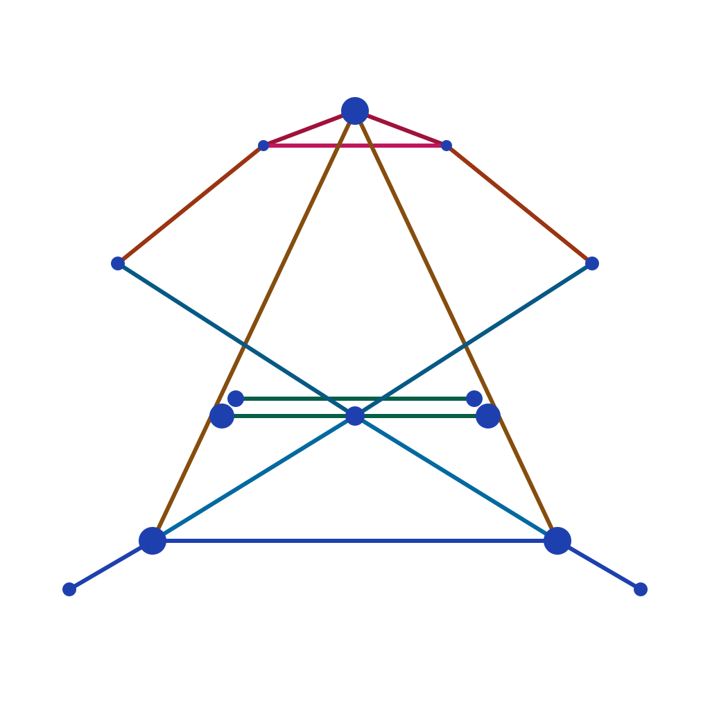

<p align="center" markdown>
  <picture>
    <source media="(prefers-color-scheme: dark)" srcset="assets/logo-dark.svg">
    <source media="(prefers-color-scheme: light)" srcset="assets/logo-light.svg">
    
  </picture>
</p>

# security-atlas

> Open-source, self-hostable, replacement-grade GRC. Run SOC 2, ISO 27001,
> NIST CSF, PCI DSS, HIPAA, and GDPR from **one** source of truth.

<!-- Slice 057 shipped the hero screenshot at docs/images/hero-dashboard.png.
     The docs-site does NOT embed it: the canonical README on GitHub renders
     it inline and the mkdocs site links to the README via the canvas link
     below. Keeping this as a pointer rather than duplicating ~250 KB of
     PNGs into docs-site/docs/. -->

<!-- prettier-ignore-start -->
!!! info "What you'll learn"

    - What security-atlas is (and what it deliberately is not)
    - Who it's built for in v1
    - The architectural shape — one control graph, many frameworks
<!-- prettier-ignore-end -->

## What it is

security-atlas is a **control-graph and evidence-pipeline platform**.
The spine is the [Secure Controls Framework](https://securecontrolsframework.com/)
— ~1,400 SCF anchors crosswalked to 200+ frameworks via NIST IR 8477 STRM.
The wire format is [NIST OSCAL](https://pages.nist.gov/OSCAL/).

| Layer            | What it does                                                                  |
| ---------------- | ----------------------------------------------------------------------------- |
| Evidence ledger  | Append-only record of every observation, with `observed_at` + sha256 hash     |
| Evaluation stage | Read-only consumer of the ledger; computes per-control state, never writes it |
| UCF graph        | One control satisfies N framework requirements through SCF anchors            |
| Scope cells      | Multidimensional tuples (BU × env × geo × cloud × data class × product)       |
| AuditPeriod      | Frozen-horizon snapshot — auditor sees state as of `frozen_at`, not live      |

## Who it's for (v1)

The **solo security leader at a 50–150-person security-product startup** who
runs the entire program alone — risk register, board reporting, SOC 2,
vendor reviews, policies, exceptions — and whose customers will diligence
the diligence tool itself.

The v1 success test is binary: that user runs the next SOC 2 audit out of
security-atlas, generates the next quarterly board pack from it, and does
not reach for Vanta or a Google Sheet to fill a gap.

## What it isn't

- A policy template warehouse. v1 ships **5** high-signal stock policies,
  not 50 placeholders.
- An LLM that publishes audit-binding artifacts. AI suggests; humans
  approve, every time, with citations to specific evidence IDs.
- A continuous-monitoring product that polls every 24 hours and calls it
  continuous. Event-driven where the source supports it; named honestly
  otherwise.
- A trust center. Deferred to phase 3 unless real customers ask for it.

## Architectural shape

```
   Connectors / Pushers  ───►  Ingestion  ───►  Evidence Ledger  ───►  Evaluation  ───►  Control State
       (pull / push)            (append)         (immutable)          (read-only)        (computed)
                                                                                              │
                                                                  ┌───────────────────────────┴───────────────────────────┐
                                                                  ▼                                                       ▼
                                                            OSCAL SSP / POA&M                                       Board reporting
                                                            (auditor exports)                                       (monthly / quarterly)
```

Two architectural invariants govern every feature:

1. **Ingestion and evaluation are separated stages** with an append-only
   ledger between them. Evaluation never writes to evidence. Bugs in
   evaluation never corrupt the record.
2. **One control, N framework satisfactions.** The UCF is a graph with
   STRM-typed edges through SCF anchors. Controls are never duplicated
   per framework.

The full design lives in [`Plans/ARCHITECTURE_CANVAS.md`](https://github.com/mgoodric/security-atlas/blob/main/Plans/ARCHITECTURE_CANVAS.md).

## Next steps

- [Install →](install.md) — self-host quickstart with `docker compose`

---

## Was this helpful?

Tell us in [GitHub Discussions](https://github.com/mgoodric/security-atlas/discussions).
Page issues can also be filed via the **Edit this page** link above.
