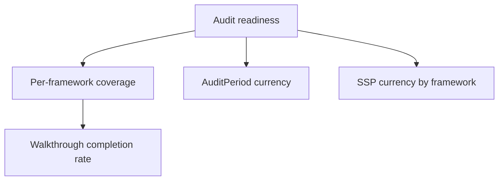
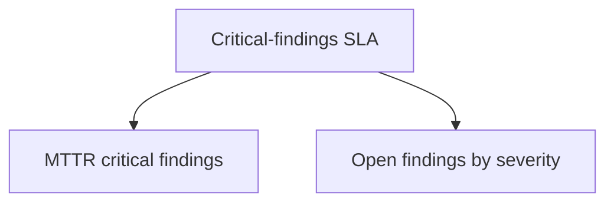
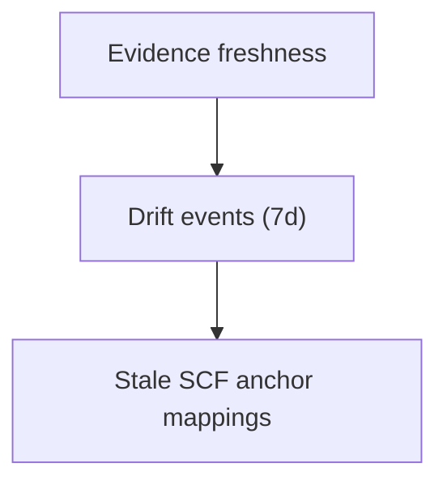
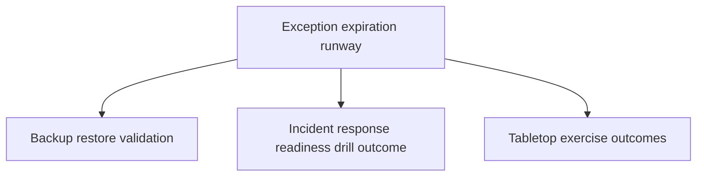
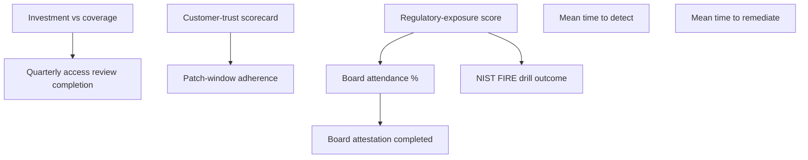
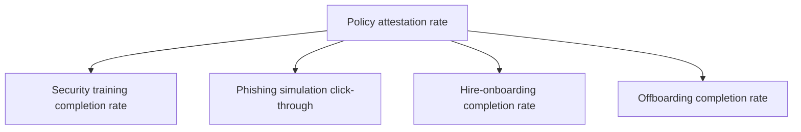
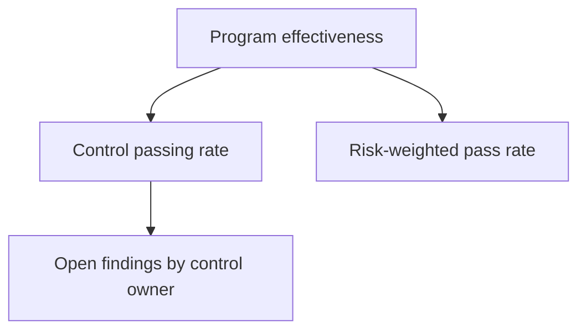
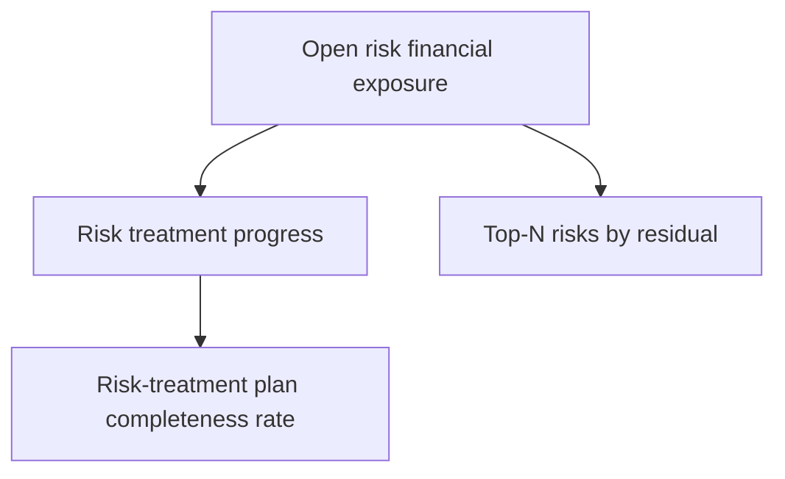
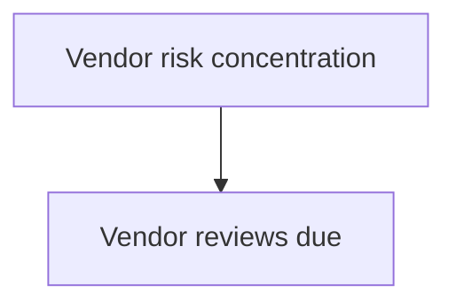

# Metrics reference

> Auto-generated from `catalogs/metrics/*.yaml` by `just metrics-reference`.
> Do NOT edit by hand. Edit the YAML and re-run the generator.

## Catalog overview

| Files | Metrics | Cascade edges |
| ----- | ------- | ------------- |
| 9     | 40      | 27            |

## Audit Readiness

_Source: `catalogs/metrics/audit-readiness.yaml`_

| ID                            | Level   | Cadence | Compute                            | Unit    | Notes                                                             |
| ----------------------------- | ------- | ------- | ---------------------------------- | ------- | ----------------------------------------------------------------- |
| `audit_readiness_score`       | board   | daily   | computed (`audit_readiness_score`) | percent | A dip in this metric is the most common board-meeting "explain    |
| `framework_coverage_pct`      | program | daily   | manual_input                       | percent | The cascade child the v1 persona drills into when audit_readiness |
| `audit_period_currency`       | program | daily   | manual_input                       | days    | Pairs with audit_readiness_score to disambiguate "we're prepared" |
| `ssp_currency`                | program | weekly  | manual_input                       | days    | Stays manual_input until the OSCAL export pipeline emits a        |
| `walkthrough_completion_rate` | team    | weekly  | manual_input                       | percent | Per the v1 persona's pattern, walkthroughs cluster in the two     |

## Critical Sla

_Source: `catalogs/metrics/critical-sla.yaml`_

| ID                       | Level   | Cadence | Compute                            | Unit    | Notes                                                            |
| ------------------------ | ------- | ------- | ---------------------------------- | ------- | ---------------------------------------------------------------- |
| `critical_findings_sla`  | board   | weekly  | computed (`critical_findings_sla`) | percent | Composes from audit_notes where severity='finding' AND           |
| `mttr_critical_findings` | program | weekly  | manual_input                       | days    | Manual until the audit_notes close-time aggregation query lands. |
| `open_findings_severity` | program | daily   | manual_input                       | count   | Manual roll-up; the v1 persona reads this off the audit hub      |

## Evidence Freshness

_Source: `catalogs/metrics/evidence-freshness.yaml`_

| ID                       | Level   | Cadence   | Compute                             | Unit    | Notes                                                          |
| ------------------------ | ------- | --------- | ----------------------------------- | ------- | -------------------------------------------------------------- |
| `evidence_freshness_pct` | board   | realtime  | computed (`evidence_freshness_pct`) | percent | Realtime cadence because evidence_freshness refreshes on every |
| `drift_events_7d`        | program | daily     | manual_input                        | count   | Drift events are the operational signal that something changed |
| `stale_anchor_mappings`  | team    | quarterly | manual_input                        | count   | Manual confirmation pattern because the SCF release cycle is   |

## Exception Runway

_Source: `catalogs/metrics/exception-runway.yaml`_

| ID                                | Level | Cadence   | Compute                                  | Unit    | Notes                                                          |
| --------------------------------- | ----- | --------- | ---------------------------------------- | ------- | -------------------------------------------------------------- |
| `exception_expiration_runway`     | board | weekly    | computed (`exception_expiration_runway`) | count   | The 30-day window matches canvas §6.3's first-class            |
| `backup_restore_validation`       | team  | quarterly | manual_input                             | percent | Manual quarterly drill. No connector source candidate for v1 — |
| `incident_response_drill_outcome` | team  | quarterly | manual_input                             | percent | Binary score because the maintainer's quarterly IR drill is    |
| `tabletop_exercise_outcome`       | team  | quarterly | manual_input                             | percent | Manual entry. Pattern-matched to the v1 persona's quarterly    |

## Investment Coverage

_Source: `catalogs/metrics/investment-coverage.yaml`_

| ID                                   | Level   | Cadence   | Compute              | Unit        | Notes                                                             |
| ------------------------------------ | ------- | --------- | -------------------- | ----------- | ----------------------------------------------------------------- |
| `investment_vs_coverage`             | board   | quarterly | manual_input         | dollars_ale | Manual-only by design — canvas §7.5 names this as a critical      |
| `customer_trust_scorecard`           | board   | quarterly | manual_input         | percent     | Manual-only. The v1 persona keeps the underlying spreadsheet;     |
| `regulatory_exposure_score`          | board   | quarterly | manual_input         | percent     | Manual-only. Pattern-matched to the v1 persona's read of "what    |
| `quarterly_access_review_completion` | team    | quarterly | manual_input         | percent     | Pattern-matched to SOC 2's quarterly review cadence. Manual       |
| `patch_window_adherence`             | team    | weekly    | external_integration | percent     | External integration placeholder (endpoint-management connector — |
| `mttd`                               | program | monthly   | external_integration | days        | External integration placeholder (SIEM connector — Datadog /      |
| `mttr`                               | program | monthly   | external_integration | days        | External integration placeholder (ticketing connector — Jira /    |
| `board_attendance_pct`               | team    | quarterly | manual_input         | percent     | Manual entry. The v1 persona reads attendance off the calendar    |
| `board_attestation_completed`        | team    | quarterly | manual_input         | percent     | Manual entry. The v1 persona records this once the board chair    |
| `nist_fire_drill_outcome`            | team    | quarterly | manual_input         | percent     | Manual entry. Pairs with incident_response_drill_outcome to show  |

## Policy Attestation

_Source: `catalogs/metrics/policy-attestation.yaml`_

| ID                           | Level | Cadence   | Compute                              | Unit    | Notes                                                             |
| ---------------------------- | ----- | --------- | ------------------------------------ | ------- | ----------------------------------------------------------------- |
| `policy_attestation_rate`    | board | monthly   | computed (`policy_attestation_rate`) | percent | Denominator is "required acknowledgments outstanding now";        |
| `training_completion_rate`   | team  | quarterly | external_integration                 | percent | External integration placeholder; v1 treats it like manual_input. |
| `phishing_simulation_ctr`    | team  | monthly   | external_integration                 | percent | External integration placeholder; v1 takes manual export from the |
| `hire_onboarding_completion` | team  | monthly   | external_integration                 | percent | External integration placeholder (HRIS connector — Rippling /     |
| `offboarding_completion`     | team  | monthly   | external_integration                 | percent | Lower-window cadence than onboarding because a slow offboarding   |

## Program Effectiveness

_Source: `catalogs/metrics/program-effectiveness.yaml`_

| ID                        | Level   | Cadence | Compute                            | Unit    | Notes                                                             |
| ------------------------- | ------- | ------- | ---------------------------------- | ------- | ----------------------------------------------------------------- |
| `program_effectiveness`   | board   | weekly  | computed (`program_effectiveness`) | percent | The weighting is what keeps this honest: a 95% pass rate across   |
| `control_pass_rate`       | program | daily   | manual_input                       | percent | Auto-promoted to computed when the eval engine's bulk-summarize   |
| `risk_weighted_pass_rate` | program | weekly  | manual_input                       | percent | Manual input until the cross-aggregate is wired (likely the       |
| `open_findings_team`      | team    | daily   | manual_input                       | count   | Manual roll-up until the audit_notes aggregation query lands as a |

## Risk Financial Exposure

_Source: `catalogs/metrics/risk-financial-exposure.yaml`_

| ID                                 | Level   | Cadence   | Compute                                   | Unit        | Notes                                                            |
| ---------------------------------- | ------- | --------- | ----------------------------------------- | ----------- | ---------------------------------------------------------------- |
| `open_risk_financial_exposure`     | board   | weekly    | computed (`open_risk_financial_exposure`) | dollars_ale | ALE assumes the risk's annualized_loss field is set; risks with  |
| `risk_treatment_progress`          | program | monthly   | manual_input                              | percent     | Manual roll-up until the decision_audit_log query for "treatment |
| `top_risks_residual`               | program | weekly    | manual_input                              | count       | Dimensions['risk_ids'] holds the top-5 list; the numeric_value   |
| `risk_treatment_plan_completeness` | team    | quarterly | manual_input                              | percent     | The v1 persona reviews this each quarter as part of the risk     |

## Vendor Risk

_Source: `catalogs/metrics/vendor-risk.yaml`_

| ID                          | Level   | Cadence | Compute                                | Unit  | Notes                                                           |
| --------------------------- | ------- | ------- | -------------------------------------- | ----- | --------------------------------------------------------------- |
| `vendor_risk_concentration` | board   | monthly | computed (`vendor_risk_concentration`) | count | The metric is intentionally a single number rather than a list  |
| `vendor_reviews_due`        | program | weekly  | manual_input                           | count | Manual until the vendor module's burndown query is exposed as a |

---

Generated by `scripts/gen-metrics-reference.sh`.
