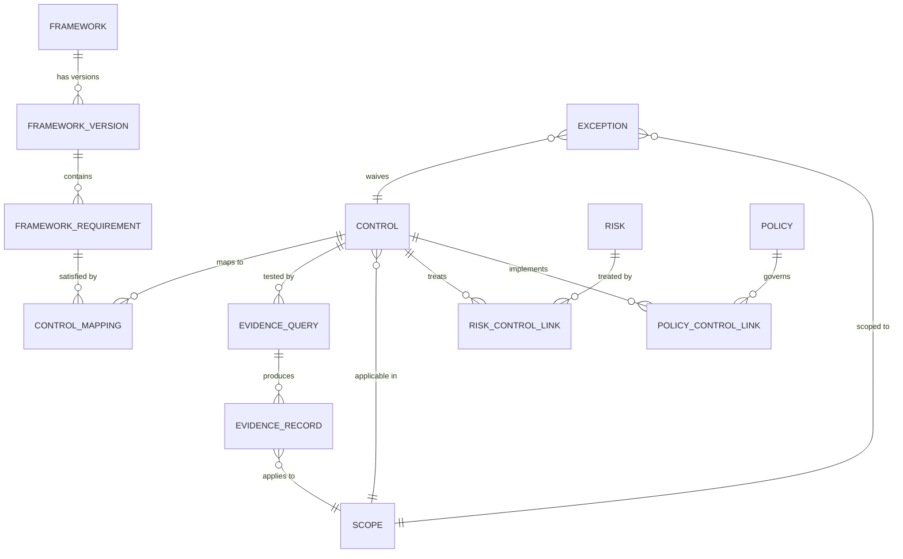

# Primitives — how to use the six load-bearing entities

<!-- prettier-ignore-start -->
!!! info "What you'll learn"

    - The six primitives the platform is built on
    - How each one works day-to-day
    - Where to look first for each primitive's how-to
<!-- prettier-ignore-end -->

security-atlas is built on **six primitives** plus the relationships
between them. Everything else — audit periods, samples, walkthroughs,
findings — is a composition over these six. (See [canvas
§2](https://github.com/mgoodric/security-atlas/blob/main/Plans/canvas/02-primitives.md)
for the architectural rationale.)

| Primitive                 | What it is                                                          | Page              |
| ------------------------- | ------------------------------------------------------------------- | ----------------- |
| [Control](controls.md)    | A requirement evaluated per scope cell, per point in time.          | [→](controls.md)  |
| [Risk](risks.md)          | A statement of plausible loss; controls treat risks.                | [→](risks.md)     |
| [Evidence](evidence.md)   | A single observation about reality at a point in time. Append-only. | [→](evidence.md)  |
| [Scope](scope.md)         | A coordinate in an N-dimensional space — not a tree.                | [→](scope.md)     |
| [Framework](framework.md) | An external standard (SOC 2, ISO 27001, PCI DSS) and its versions.  | [→](framework.md) |
| [Policy](policy.md)       | A governance document that references controls.                     | [→](policy.md)    |

## How the primitives compose

The diagram is intentionally small. Six entities, a handful of
relationships. Read each page in roughly this order if you're new to
the platform:

1. [Control](controls.md) — the unit of measurement.
2. [Evidence](evidence.md) — what controls read.
3. [Scope](scope.md) — where everything lives.
4. [Framework](framework.md) — what controls satisfy.
5. [Policy](policy.md) — what controls implement.
6. [Risk](risks.md) — what controls treat.

## Operator note — manual is first-class

A `manual_attested` control has the same surface as an `automated` one.
A manually-uploaded evidence record has the same shape as a connector-
emitted one. A policy authored in the UI is no less rigorous than one
imported from a Word document. **Constitutional invariant 9.**

If your program is 30% manual today, the platform reflects that 30%
with the same dashboard fidelity as the 70% automated. No artificial
"green" because the tool can't see the manual half.

## Next steps

Pick the primitive that matches your current question and start there.

---

## Was this helpful?

Tell us in [GitHub
Discussions](https://github.com/mgoodric/security-atlas/discussions).
