# Logo design — candidates and selection

> **Status:** awaiting maintainer approval.
> **Selection mechanism:** edit the `Selected:` line at the bottom of this file to a real candidate ID (e.g. `Selected: candidate-04`), commit on `main`. Slice 075 (logo integration) detects the edit via `grep '^Selected:' docs/design/logo-decision.md | grep -v 'awaiting maintainer approval'` and proceeds with integration across README hero, mkdocs theme, web UI top-nav, favicon set, and social-share cards.

This page presents 10 logo candidates produced by slice 074 (the `Media:Art` PAI skill / `Artist` agent). The slate spans typographic wordmarks, abstract control-graph marks, cartographic atlas-evocative shapes, and hexagonal scope-cell geometry. Every candidate ships in both light and dark variants and passes WCAG 2.2 ≥4.5:1 contrast on its target background.

Constraints honored across the slate:

- No security-padlock / shield / fortress / vault / lock / key / chain imagery (per P0-A5)
- No image-model-rendered text inside any mark (text composited separately via Inter font, per P0-A2)
- All AI models used (Flux 1.1 Pro, Nano Banana) permit commercial use; Apache-2.0 compatible (per P0-A3)
- Three distinct directions minimum (per P0-A4; we ship four: typographic, abstract-geometric, cartographic, lattice/hex)

For each candidate, both the canonical (light-background) mark and the dark-background variant are shown, followed by a brief concept paragraph and per-candidate strengths/weaknesses. Full per-candidate provenance (model, version, prompt, contrast measurement, wordmark font) lives in each candidate's `notes.md` at `docs/design/logo-candidates/candidate-NN/notes.md`.

---

## Candidate 01 — Cartographic contour

| Light variant                                                      | Dark variant                                                           |
| ------------------------------------------------------------------ | ---------------------------------------------------------------------- |
| 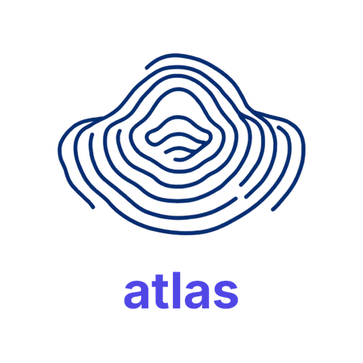 | 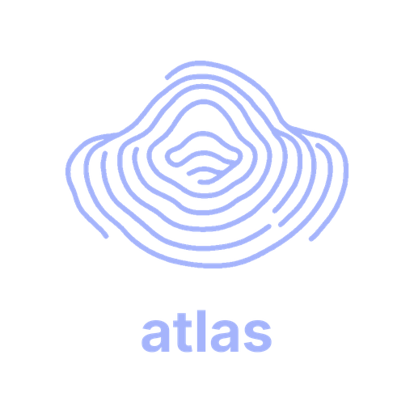 |

Concentric topographic contour lines forming a soft asymmetric ridge, evoking the "atlas-as-map" anchor. Reads as elevation lines on a topographic map — territory rendered as a system of layers, mirroring the platform's mapping of one control to many framework satisfactions.

**Wordmark:** `atlas` (Inter Bold, composited below mark) · **Model:** Flux 1.1 Pro · **SVG:** raster-only

- **Strengths:** unmistakably cartographic; directly evokes the "atlas" name; indigo (`#4f46e5`) aligns with existing mockup palette
- **Weaknesses:** organic/fingerprinty shape may not telegraph "infrastructure platform" at first glance

[→ full notes](./logo-candidates/candidate-01/notes.md)

---

## Candidate 02 — Control-graph nodes

| Light variant                                                      | Dark variant                                                           |
| ------------------------------------------------------------------ | ---------------------------------------------------------------------- |
| 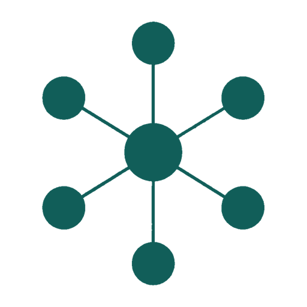 | 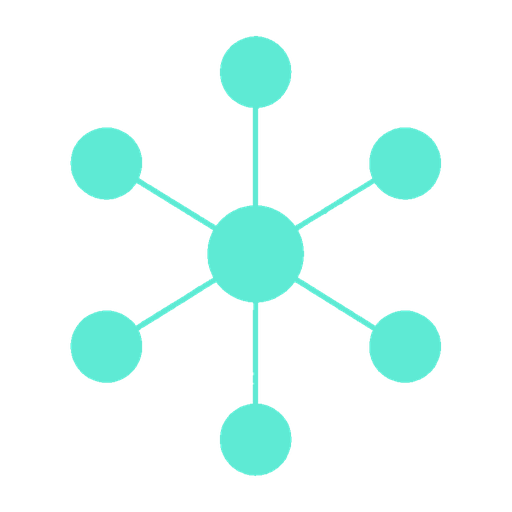 |

Hub-and-spoke node geometry: a central anchor node connected to 5-7 surrounding nodes by thin lines. Directly references the SCF anchor concept — one canonical control with many framework satisfactions radiating outward.

**Wordmark:** none — mark-only · **Model:** Flux 1.1 Pro · **SVG:** raster-only

- **Strengths:** literally the platform's data model (control-graph); recognizable as "infrastructure" at first glance; works without text
- **Weaknesses:** node-graph aesthetic is common in dev tooling; needs distinctive node treatment to stand out from generic graph-database logos

[→ full notes](./logo-candidates/candidate-02/notes.md)

---

## Candidate 03 — Spine-and-branches dendrogram

| Light variant                                                      | Dark variant                                                           |
| ------------------------------------------------------------------ | ---------------------------------------------------------------------- |
| 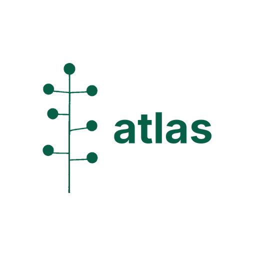 | 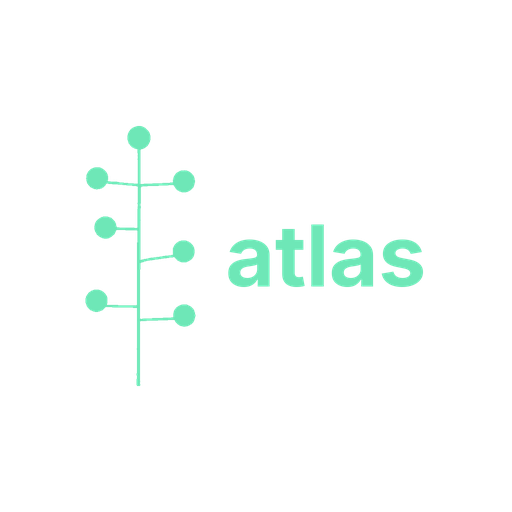 |

Central vertical spine with 4-6 branches forking outward — a dendrogram or evidence-lineage tree. Maps to the canvas §5 multidimensional-scope geometry (one control, applied through many scope cells).

**Wordmark:** `atlas` (Inter Bold, composited right of spine) · **Model:** Flux 1.1 Pro · **SVG:** raster-only

- **Strengths:** uncommon shape in security tooling; reads as "lineage" or "audit trail" semantically
- **Weaknesses:** branching dendrogram could be misread as a phylogenetic tree if context isn't clear

[→ full notes](./logo-candidates/candidate-03/notes.md)

---

## Candidate 04 — Node-graph "A" (pastel, v5 — four-slot palette, per-variant pastel + sky-complement)

| Light variant                                                      | Dark variant                                                           |
| ------------------------------------------------------------------ | ---------------------------------------------------------------------- |
|  |  |

Layered node-and-edge graph implying a stylized capital A, in a **four-slot color hierarchy** (heavy / medium / light line tiers + a dedicated dot color). Dark variant uses the maintainer-specified pastel set verbatim: `#90D5FF` heavy backbone, `#57B9FF` medium connectors, `#77B1D4` light scaffolding, `#517891` node dots. Light variant uses sky-scale dark complements that mirror the same hierarchy (`#0c4a6e` / `#075985` / `#0369a1` for lines) plus `#517891` for dots (preserved literally across both variants — the brand-family through-line). Every line endpoint terminates at a node coordinate (22/22 verified within 0.5px).

**Wordmark:** none — mark-only · **Source:** hand-authored SVG (cand-04 is the only SVG-native mark in the slate) · **Render path:** `tools/logo-gen/recolor_by_weight.py` (deterministic — bit-perfect hex per slot, per variant) · **Accessibility standard:** WCAG SC 1.4.11 Non-text Contrast (≥3:1) — the correct standard for logo graphical objects · **Iteration:** v5 (adopts maintainer-specified pastel palette; introduces a 4th color slot for dots)

- **Strengths:** distinctive pastel palette on dark bg (the only candidate in the slate using sky-blue / pastel — every other candidate is indigo/violet/teal/etc.); explicit graph hierarchy via four color slots (heavy/medium/light lines + dedicated dot color); all eight color slots clear WCAG SC 1.4.11 on their target bg; the dot color (`#517891`) is preserved literally on both variants as a brand-family through-line; topologically clean (22/22 endpoint-node matches); SVG-native; 139 KB combined
- **Weaknesses:** the candidate departs from the application's existing indigo brand identity (the mockups use indigo `#6366f1` family) — if selected, the application UI would need to converge on the pastel/sky palette OR this candidate accepts an outlier brand identity vs the existing mockup style; the dark NODES slot at 4.19:1 vs `#0a0a0a` passes SC 1.4.11 but fails SC 1.4.3 (text-contrast); light + dark variants are no longer color-inverse twins (share only `#517891`) — different rhythm vs other candidates whose two variants are tonal mirrors

[→ full notes](./logo-candidates/candidate-04/notes.md) · [→ source SVG](./logo-candidates/candidate-04/mark.svg)

---

## Candidate 05 — Anchor + lattice diamond

| Light variant                                                      | Dark variant                                                           |
| ------------------------------------------------------------------ | ---------------------------------------------------------------------- |
| 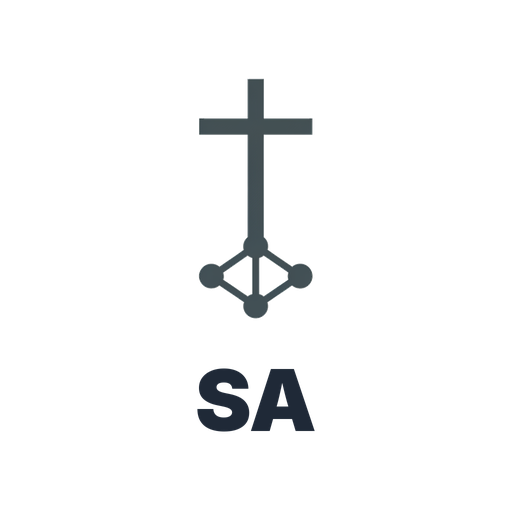 | 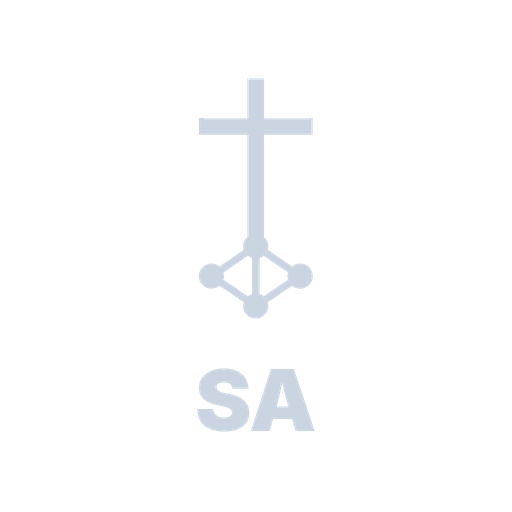 |

A single anchor symbol with a subtle lattice/diamond extension — anchor in the SCF sense (canonical control reference), not nautical. The lattice element keeps the mark from reading as maritime.

**Wordmark:** `SA` (Inter Black, composited below mark) · **Model:** Nano Banana · **SVG:** raster-only

- **Strengths:** the only candidate that pushes on the "anchor" semantic literally; the lattice keeps it from reading nautical
- **Weaknesses:** anchor imagery has heavy maritime associations regardless of context; risks the wrong mental model

[→ full notes](./logo-candidates/candidate-05/notes.md)

---

## Candidate 06 — `SA` monogram (pure typographic)

| Light variant                                                      | Dark variant                                                           |
| ------------------------------------------------------------------ | ---------------------------------------------------------------------- |
| 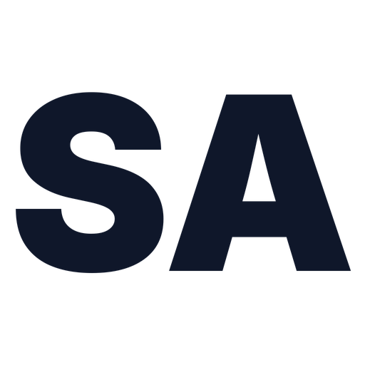 | 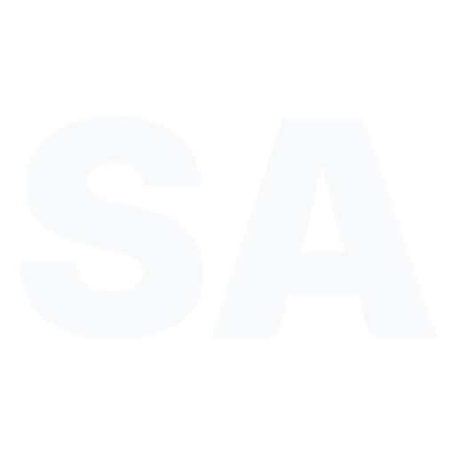 |

Pure typographic monogram: Inter Black 900-weight "SA" with tight kerning. The mark IS the letterforms — no decorative shape. Scales to favicon (32×32) cleanly because nothing depends on resolution-sensitive geometry.

**Wordmark:** `SA` (mark IS wordmark, Inter Black) · **Model:** none — pure PIL/Inter composit · **SVG:** native (mark.svg)

- **Strengths:** scales perfectly (native SVG); zero AI provenance risk; the most distinctive favicon candidate in the slate
- **Weaknesses:** least distinctive at large sizes (looks like 100+ other dev-tool wordmark monograms); no concept payload beyond the initials

[→ full notes](./logo-candidates/candidate-06/notes.md)

---

## Candidate 07 — `security-atlas` wordmark with indigo accent

| Light variant                                                      | Dark variant                                                           |
| ------------------------------------------------------------------ | ---------------------------------------------------------------------- |
| 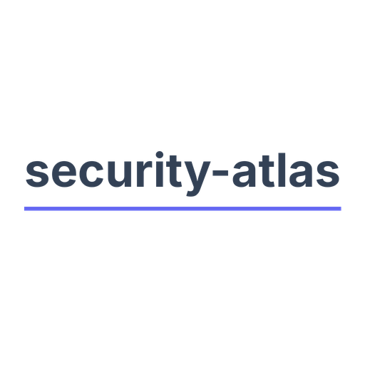 | 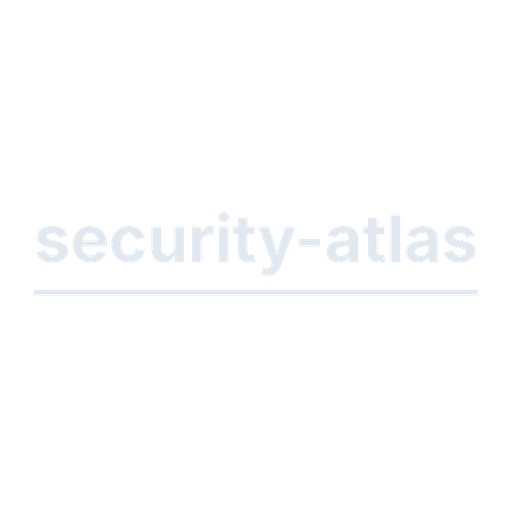 |

Full project name as a clean Inter Bold wordmark with a subtle indigo underline accent — the underline doubles as a visual hint at the control-graph baseline. Pure typographic; no AI image content.

**Wordmark:** `security-atlas` (mark IS wordmark, Inter Bold + SVG decoration) · **Model:** none — pure PIL/Inter composit · **SVG:** native (mark.svg)

- **Strengths:** explicit project name (best for SEO + first-impression "what is this"); zero AI risk; indigo accent matches existing mockup palette
- **Weaknesses:** long wordmark (15 characters with hyphen); doesn't scale to favicon; the underline accent is subtle to the point of "is that intentional?"

[→ full notes](./logo-candidates/candidate-07/notes.md)

---

## Candidate 08 — `security · atlas` with cyan graph-glyph

| Light variant                                                      | Dark variant                                                           |
| ------------------------------------------------------------------ | ---------------------------------------------------------------------- |
| 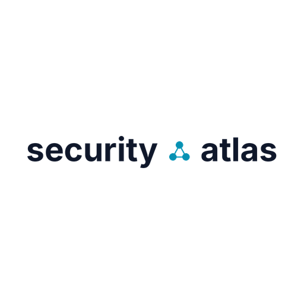 | 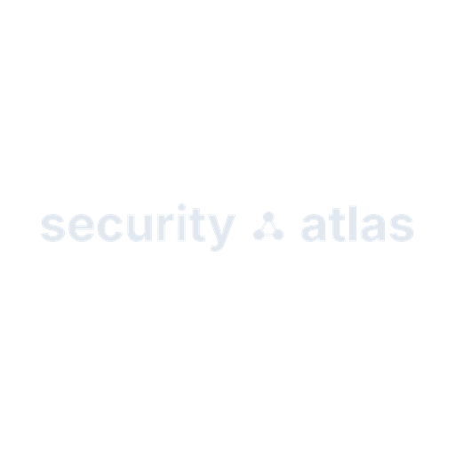 |

Two-word stylization with a middle-dot replaced by a tiny cyan node-graph glyph (Flux-generated, ~64×64 pixels). The glyph carries the brand concept; the Inter Bold text carries the name.

**Wordmark:** `security · atlas` (Inter Bold + Flux-generated glyph) · **Model:** Flux 1.1 Pro (glyph only) · **SVG:** native (mark.svg, glyph embedded as raster)

- **Strengths:** the only candidate that combines wordmark and mark in one composition; cyan accent provides distinctive color identity; the middle-dot-as-glyph is unusual
- **Weaknesses:** the glyph is small (visible at 1024px, almost invisible at favicon size); two-word stylization is slower to read than hyphenated; cyan may clash with existing indigo UI

[→ full notes](./logo-candidates/candidate-08/notes.md)

---

## Candidate 09 — Hexagonal control-cell

| Light variant                                                      | Dark variant                                                           |
| ------------------------------------------------------------------ | ---------------------------------------------------------------------- |
| 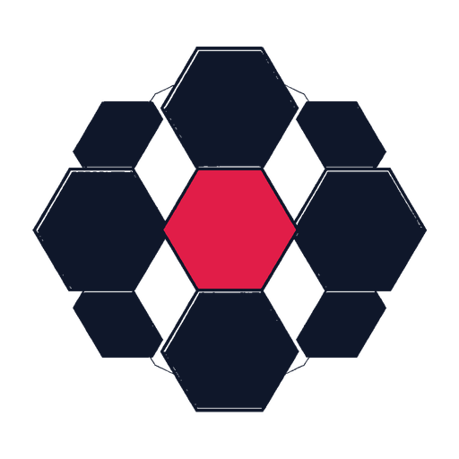 | 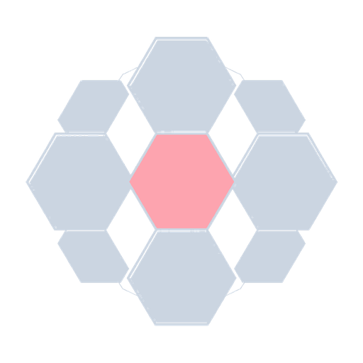 |

A hexagonal frame surrounding a single highlighted center cell — references the scope-cell tuple geometry (BU × env × geo × cloud × data_class × product). The highlighted center reads as "the evidence-pipeline-cell currently in focus".

**Wordmark:** none — mark-only · **Model:** Flux 1.1 Pro · **SVG:** raster-only

- **Strengths:** literally the scope-cell data model from canvas §5; hexagons read as "infrastructure" without dipping into the cybersecurity-stock-imagery well
- **Weaknesses:** hex grids are common in dev tooling (Linear, Discord, etc.); the highlighted-center could be misread as "selected cell" UI rather than a brand mark

[→ full notes](./logo-candidates/candidate-09/notes.md)

---

## Candidate 10 — Stylized "A" from violet control-graph

| Light variant                                                      | Dark variant                                                           |
| ------------------------------------------------------------------ | ---------------------------------------------------------------------- |
| 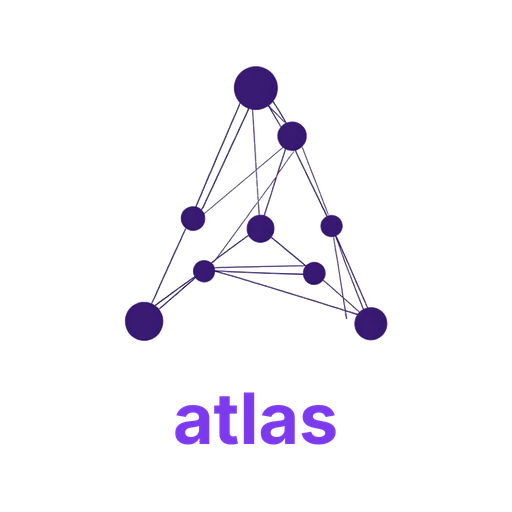 | 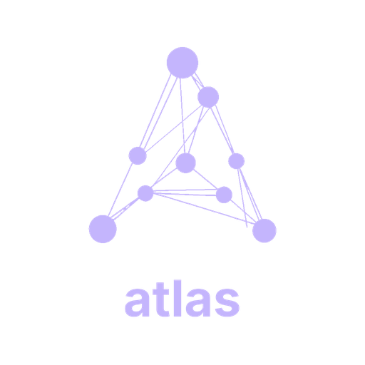 |

A literal letter-"A" silhouette constructed from a violet control-graph node-and-edge composition. Closes the loop between candidate 02 (pure node graph) and candidate 06 (pure typographic) — concept of control-graph rendered as letterform.

**Wordmark:** `atlas` (Inter Bold, composited below mark) · **Model:** Flux 1.1 Pro · **SVG:** raster-only

- **Strengths:** the most concept-dense candidate; the "A" emergence is more legible than candidate 04; violet provides palette differentiation from the indigo-heavy alternatives
- **Weaknesses:** the node-graph-as-A composition is busy at small sizes; favicon rendering would lose the A entirely

[→ full notes](./logo-candidates/candidate-10/notes.md)

---

## Decision

Selected: none — awaiting maintainer approval
