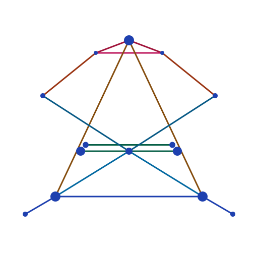
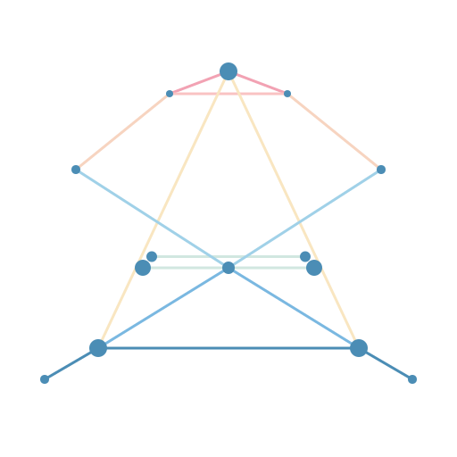

# Logo design — selected candidate

> **Status:** selected. Slice 075 (logo integration) is unblocked and will propagate the mark across the README hero, mkdocs theme, web UI top-nav, favicon set, and social-share cards once it ships.

This slice originally produced a 10-candidate slate spanning typographic wordmarks, abstract control-graph marks, cartographic atlas-evocative shapes, and hexagonal scope-cell geometry. The maintainer iterated on candidate-04 through six versions to land on the design below. After selection, the nine unselected candidates and the throwaway generation tooling were removed from the repo (the decisions log + git history preserves the full design trajectory). What remains is the source-of-truth assets for slice 075 to integrate.

## Selected candidate

**Candidate 04 — Node-graph "A" (warm→cool gradient, v6 — 16 lines, 8-color spectrum)**

| Light variant                                                      | Dark variant                                                           |
| ------------------------------------------------------------------ | ---------------------------------------------------------------------- |
|  |  |

Layered node-and-edge graph implying a stylized capital A, in a temperature-gradient color scheme. 16 lines + 14 dots; uniform 6px stroke; color carries the hierarchy. Dark variant uses an 8-color pastel spectrum (`#f2a2b3` / `#f9c3c3` / `#f7d4c0` / `#f9e6c1` / `#d1e7e0` / `#a0d1e8` / `#7ab8e1` / `#4b8db5`) arranged warm-at-apex → cool-at-foundation, with L/R sister-paired coloring for symmetric reading. Light variant mirrors the same gradient using Tailwind 700-800 family dark complements (rose-800 / pink-700 / orange-800 / amber-700 / emerald-800 / sky-800 / sky-700 / blue-800). Every line endpoint terminates at a node (32/32 endpoint-node matches within 0.5 px). All 16 color slots clear WCAG SC 1.4.11 AND SC 1.4.3.

### Source-of-truth assets

| Path                                                | Purpose                                                                                                   |
| --------------------------------------------------- | --------------------------------------------------------------------------------------------------------- |
| `./logo-candidates/candidate-04/mark.svg`           | Hand-authored SVG — canonical source. Slice 075's variant generation derives every output from this.      |
| `./logo-candidates/candidate-04/mark-1024.png`      | 1024×1024 light-bg rasterization (against `#fafafa`)                                                      |
| `./logo-candidates/candidate-04/mark-1024-dark.png` | 1024×1024 dark-bg rasterization (against `#0a0a0a`)                                                       |
| `./logo-candidates/candidate-04/mark-512.png`       | 512×512 web-optimized light                                                                               |
| `./logo-candidates/candidate-04/mark-512-dark.png`  | 512×512 web-optimized dark                                                                                |
| `./logo-candidates/candidate-04/notes.md`           | Full provenance: per-color contrast measurements, v1-v6 iteration history with every prompt + design call |

### Render tooling (kept for slice 075)

| Path                                        | Purpose                                                                                                                                                                                                                                                                                                                  |
| ------------------------------------------- | ------------------------------------------------------------------------------------------------------------------------------------------------------------------------------------------------------------------------------------------------------------------------------------------------------------------------ |
| `../../tools/logo-gen/recolor_by_weight.py` | Deterministic SVG → PNG rasterization with per-tier color mapping (`LIGHT_TO_DARK_V6` is active; v3-v5 retained as historical references). Requires `cairosvg` + `pillow`; on macOS needs `DYLD_LIBRARY_PATH=/opt/homebrew/opt/cairo/lib`. Filename is now historical — v6 recolors by line position, not stroke weight. |
| `../../tools/logo-gen/contrast.py`          | WCAG SC 1.4.11 / SC 1.4.3 contrast measurement against `#fafafa` and `#0a0a0a` backgrounds via per-pixel sampling.                                                                                                                                                                                                       |

## Decision

Selected: candidate-04
