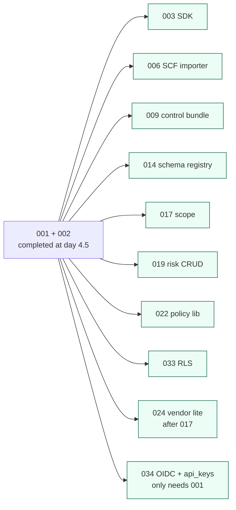

# v1 Issue Dependency Graph

Visualizes the 49 slices and their dependencies. Companion to [`_INDEX.md`](./_INDEX.md).

> **Reading:** arrows point **from** a prerequisite **to** a dependent. Layer = topological depth from the root.
> **Last updated:** post-review (commit applying `_REVIEW.md` D1–D6 findings). New edges: 005→034, 010→014, 012→015, 030→022, 037 deps expanded, 040→015/021/023. Removed: 028→016.

```mermaid
graph TD
    %% Spine ordering: skeleton -> schema -> SDK -> AWS connector -> frontend
    subgraph spine [Spine]
        I001[001 monorepo skeleton]
        I002[002 schema + migrations]
        I003[003 SDK proto + push + CLI]
        I004[004 AWS connector S3]
        I005[005 frontend bootstrap]
    end

    subgraph catalog [Catalog and UCF graph]
        I006[006 SCF importer]
        I007[007 SOC 2 crosswalk]
        I008[008 UCF graph traversal]
    end

    subgraph controlasCode [Control as code]
        I009[009 control bundle format]
        I010[010 50 SOC 2 controls]
        I011[011 manual control attest]
        I012[012 control state eval]
    end

    subgraph evpipeline [Evidence pipeline]
        I013[013 ledger write + push API]
        I014[014 schema registry]
        I015[015 NATS buffer + ingest]
        I016[016 freshness + drift]
    end

    subgraph scope [Scope + FrameworkScope]
        I017[017 scope + applicability]
        I018[018 FrameworkScope]
    end

    subgraph risk [Risk register]
        I019[019 risk CRUD]
        I020[020 risk-control linkage]
        I021[021 exceptions]
    end

    subgraph policies [Policies]
        I022[022 policy library]
        I023[023 policy ack]
    end

    subgraph vendor [Vendor]
        I024[024 vendor lite]
    end

    subgraph audit [Audit workflow]
        I025[025 auditor role]
        I026[026 sample-pull]
        I027[027 walkthrough]
        I028[028 audit-period freeze]
        I029[029 Audit Hub comments]
        I030[030 OSCAL SSP+POA&M]
    end

    subgraph board [Board reporting]
        I031[031 monthly brief]
        I032[032 quarterly pack]
    end

    subgraph authcluster [Auth / multi-tenancy]
        I033[033 RLS enforcement]
        I034[034 OIDC + local users]
        I035[035 RBAC + ABAC OPA]
    end

    subgraph infra [Infra / deploy]
        I036[036 S3 artifact store]
        I037[037 docker-compose]
        I038[038 Helm chart]
        I039[039 CLI release pipeline]
    end

    subgraph fe [Frontend views]
        I040[040 program dashboard]
        I041[041 control detail]
        I042[042 audit workspace]
        I043[043 board pack preview]
    end

    subgraph connectors [Remaining connectors]
        I044[044 GitHub]
        I045[045 Okta]
        I046[046 1Password]
        I047[047 osquery/Fleet]
        I048[048 Jira/Linear]
        I049[049 manual upload]
    end

    %% Edges
    I001 --> I002
    I001 --> I003
    I001 --> I034
    I001 --> I039

    I002 --> I006
    I002 --> I009
    I002 --> I013
    I002 --> I014
    I002 --> I017
    I002 --> I019
    I002 --> I022
    I002 --> I024
    I002 --> I033
    I002 --> I037

    I003 --> I004
    I003 --> I013
    I003 --> I039
    I003 --> I044
    I003 --> I045
    I003 --> I046
    I003 --> I047
    I003 --> I048
    I003 --> I049

    I004 --> I037

    I005 --> I037
    I005 --> I040
    I005 --> I041
    I005 --> I043

    I006 --> I007
    I006 --> I008
    I006 --> I037
    I007 --> I008
    I007 --> I010

    I008 --> I005
    I008 --> I030
    I008 --> I041

    I009 --> I010
    I009 --> I011

    I010 --> I012
    I010 --> I037

    I013 --> I004
    I013 --> I011
    I013 --> I012
    I013 --> I015
    I013 --> I026
    I013 --> I028
    I013 --> I036
    I013 --> I037
    I013 --> I044
    I013 --> I045
    I013 --> I046
    I013 --> I047
    I013 --> I048
    I013 --> I049

    I014 --> I010
    I014 --> I013
    I014 --> I037

    I015 --> I012
    I015 --> I037
    I015 --> I040

    I012 --> I016
    I012 --> I020
    I012 --> I030
    I012 --> I031
    I012 --> I040
    I012 --> I041

    I016 --> I031
    I016 --> I040

    I017 --> I012
    I017 --> I018
    I017 --> I021
    I017 --> I024
    I017 --> I026
    I017 --> I030

    I018 --> I030

    I019 --> I020
    I019 --> I021

    I020 --> I031
    I020 --> I040

    I021 --> I040

    I022 --> I023
    I022 --> I030

    I023 --> I040

    I034 --> I005
    I034 --> I023
    I034 --> I037

    I033 --> I025
    I033 --> I035

    I034 --> I035

    I035 --> I025

    I024 --> I040

    I025 --> I027
    I025 --> I029
    I025 --> I042

    I026 --> I030
    I026 --> I042

    I027 --> I042

    I028 --> I030

    I029 --> I042

    I030 --> I032

    I031 --> I032

    I036 --> I011
    I036 --> I027
    I036 --> I037

    I037 --> I038

    I032 --> I043

    %% Removed per D6 review decision: I016 --> I028 (freezing uses raw observed_at; doesn't need freshness read-model)

    %% Styling
    classDef spineClass fill:#dbeafe,stroke:#1e40af,stroke-width:2px
    class I001,I002,I003,I004,I005 spineClass

    classDef hitlClass fill:#fef3c7,stroke:#92400e,stroke-width:2px
    class I007,I010,I022,I030,I035 hitlClass
```

## Critical path highlighted

```mermaid
graph LR
    I001[001 skeleton<br/>1.5d] --> I002[002 schema<br/>3d]
    I002 --> I006[006 SCF<br/>2d]
    I006 --> I007[007 SOC2<br/>1.5d]
    I007 --> I010[010 50 ctrls<br/>5–7d]
    I010 --> I012[012 eval<br/>2.5d]
    I012 --> I016[016 freshness<br/>1.5d]
    I016 --> I028[028 freeze<br/>2d]
    I028 --> I030[030 OSCAL<br/>4–5d]
    I030 --> I032[032 board pack<br/>2.5d]
    I032 --> I043[043 board view<br/>2d]

    classDef critical fill:#fee2e2,stroke:#991b1b,stroke-width:3px
    class I001,I002,I006,I007,I010,I012,I016,I028,I030,I032,I043 critical
```

**Critical path total:** ~28 day-equivalents serialized (post-review re-estimates).

> Note: 016 → 028 is no longer a dependency (D6 review decision); freezing uses raw `observed_at`. 016 remains on the path because user-journey-wise the dashboard's drift signal should be visible before the audit cycle's freezing step — but 028 itself does not require 016 to land first.

## Parallelism layers

After slices 001 + 002 (the "trunk") complete at day ~4.5, these 10 streams unlock simultaneously:

Realistic team-of-3 sustains ~3 parallel streams.

## DAG validation

No cycles. Verified by mental traversal — every edge points forward in the topological order shown in `_INDEX.md`. Re-verified post-review-edits (no new edges introduce cycles).

## Cluster boundaries summary (recomputed post-review)

| Layer                         | Slices                                                                                                                                                       | Notes                                                                                         |
| ----------------------------- | ------------------------------------------------------------------------------------------------------------------------------------------------------------ | --------------------------------------------------------------------------------------------- |
| **Trunk (deps-free)**         | 001                                                                                                                                                          | Skeleton — no deps                                                                            |
| **Layer 1 (only 001)**        | 002, 003, 034                                                                                                                                                | Schema, SDK, OIDC + api_keys (039 moved to Layer 2 per D5 — it depends on 003)                |
| **Layer 2 (002 + 003 chain)** | 006, 009, 014, 017, 019, 022, 024, 033, 039                                                                                                                  | Major parallelism layer (039 added per D5 layer fix)                                          |
| **Layer 3**                   | 013, 007, 018, 023, 035, 036                                                                                                                                 | Push API + traversal-deps + auth chain (note: 015 moves to Layer 4 because it depends on 013) |
| **Layer 4**                   | 004, 008, 010, 011, 015, 016 _(was Layer 4)_, 020, 021, 025                                                                                                  | Feature middle. 010 now depends on 014 (Layer 2) + 007/009 (Layer 2/3); still Layer 4.        |
| **Layer 5**                   | 005 _(now waits on 034 + 008)_, 012, 026, 027, 028, 029, 044-049                                                                                             | Frontend bootstrap + audit workflow + remaining connectors                                    |
| **Layer 6**                   | 030 _(now waits on 022 too)_, 031, 037 _(recomputed: now needs 004, 005, 006, 010, 014, 015 + originals)_, 038, 040 _(now waits on 015, 021, 023)_, 041, 042 | OSCAL, board brief, deployment bundle, frontend views                                         |
| **Layer 7**                   | 032, 043                                                                                                                                                     | Final board pack + view                                                                       |

> Post-review changes: 039 moved from Layer 1 → Layer 2 (depends on 003); 037 recomputed — it stays at Layer 6 because its expanded deps' max layer (005 at Layer 5) places it one layer later than before (was Layer 5). 040 also moves to Layer 6 because it now waits on 015 + 021 + 023.
